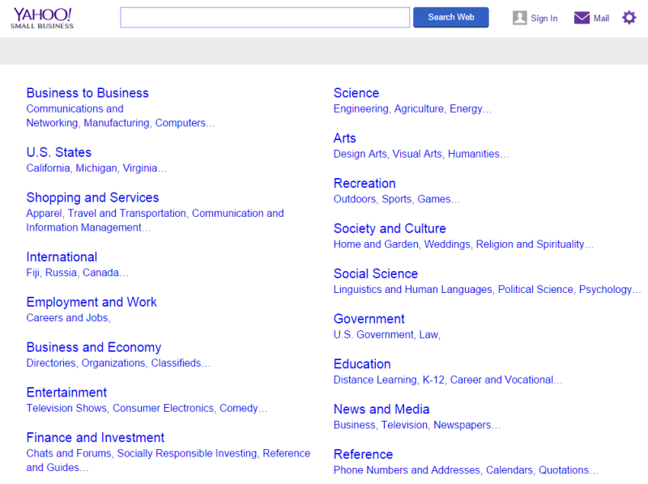
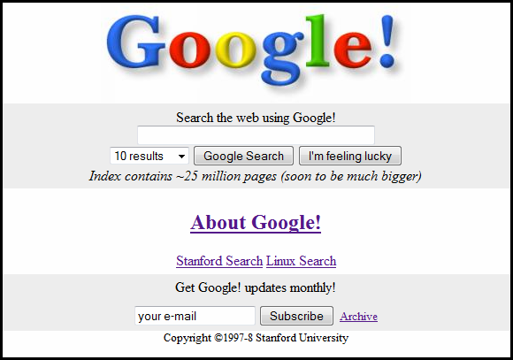

)](./asset-1.jpeg)

## Scraping and aggregating millions of candidate resumes and profiles is a solved problem. Storage is free. It’s time to bring meaning to each profile.

In the 90’s anyone could create a website. You could either use one of the free website creation tools, or you could create one by hand after learning some HTML/CSS if you were so inclined. You would still manage to get hosting for free using the many free hosting providers. It was suddenly possible for domain experts to build a community around themselves. Low-carb cooking, acrylic-on-glass painting, vintage motorcycle repair — you name it and you could build a community around it.

But with the proliferation of these islands of information, arose a new problem — how do you get to these people? Yahoo solved this by curating a database of these websites by category. Looking for info about that particular cooking recipe? Search the Yahoo Directory and you shall find it.

As the number of sites in each category grew, we now had to find out which is the best of these? Everyone is claiming that they are a great cooking recipe website — but which is truly the best? Which one deserves your time?

Here comes Google and their PageRank algorithm. By ranking each page by the number of incoming links as well as scraping the site for content — Google was able to pair the claims of the website with the validation of other similar websites linking to them. It was the first verified index of interest groups on the web.

> The story is not so different for candidate resumes and the problem of hiring.

Initially the resume was a closely guarded secret. If you were a recruiter I trust, I would share a hard copy of my resume with you, which was a history of my past companies and roles. This would still not contain details about my specific project experience and you would need to convince me for me to share those with you over phone.

Eventually the resume moved online, and you had the concept of a candidate profile online on multiple job boards. There are multiple online networks of candidates to tap into. Each candidate keeps their profile up to date and we can easily search by the kind of skill we are looking for. We quickly queue up a lot of candidates from these portals in our applicant tracking tool and then begins the arduous process of evaluating them.

To me, this sounds similar to having come across a large list of relevant sites and now visiting each of them to actually find the website that is most likely to answer my question.

> Is there a way to better validate candidates and really know who is the best — even before we start interviewing?

The answer is that this too is a solved problem — but with a catch. Companies interview candidates, and keep an ongoing record of the good ones, even though they might not have an opening at that moment. Larger companies have larger records, but there is still no way to tap into this hidden secret. This is a closely guarded secret just like the resume was in the early days.

I believe it is a matter of time before we are able to tap into a validated pool of candidates — where we can jump straight to the interview process without needing a review or screening. This is possible by running machine learning on the feedback that an interviewer might post and building a profile of what the candidate is good at. The feedback remains private to the interviewer and the company, but the validation of the candidate’s skill can be tagged to the candidate profile.

> It’s time to move from a candidate database to a smart searchable pool of verified candidate profiles.

Instead of having a candidate profile with ten different skills listed — and god forbid the all-too-common skill of being able to use Word and Excel — we have a resume of just three skills that the candidate is really good at — because they have already been interviewed on them and were positively rated.

In this world, when I am looking for candidates who are great at building websites, I instantly see the ten best candidates suites for the role, and I can skip the review or screening stages with confidence — and directly call them in for interviews!

Now, that definitely sounds like how hiring should be today!

---

_We are building Caliber — a system that understands candidates and openings more deeply. You can try our first product today — a single gathering place of all ongoing evaluations for your team._

[**Caliber**  
_Click here to get started for free and evaluate candidates faster._ www.caliberbox.com](https://www.caliberbox.com "https://www.caliberbox.com")

_Sign up is free and takes just a single click. Try it out!_

We are also on Product Hunt:

<Embed src="https://cards.producthunt.com/cards/posts/111225?v=1" height={405} width={500} />