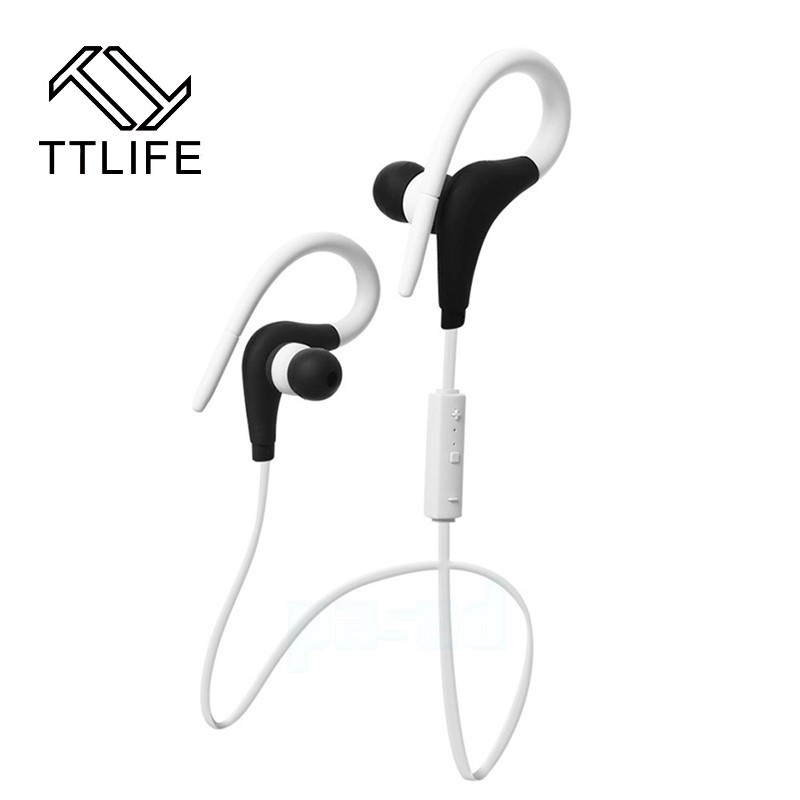
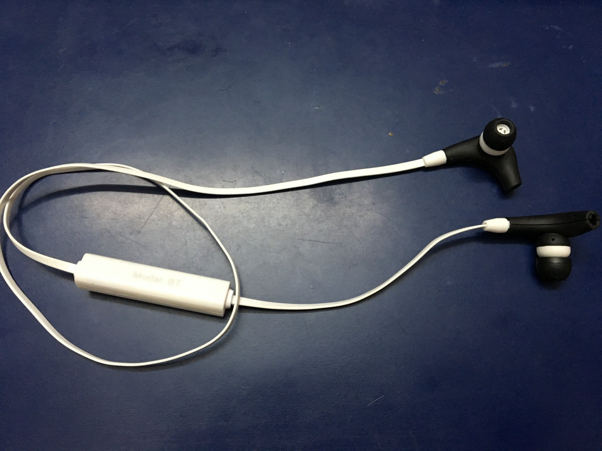
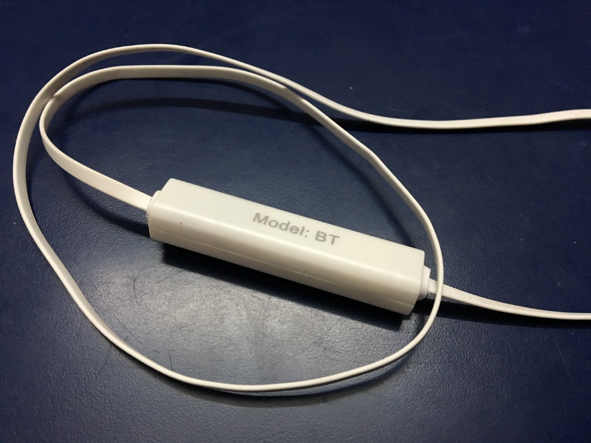
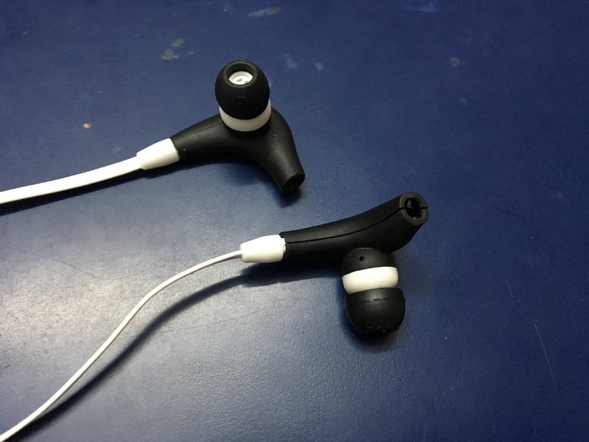
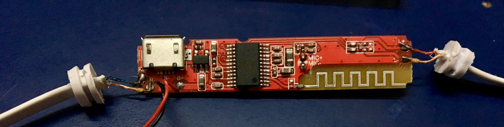
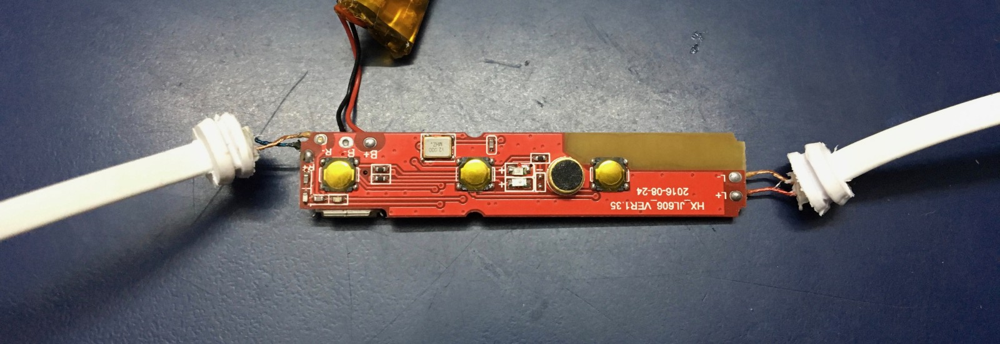

## We open them up and look inside at some of the electronics and marvel at today’s age of ubiquitous wireless earphones!

I have been wanting to try some lightweight bluetooth earphones since a while, but they have always been in the $99 range and higher. Recently I came across these on AliExpress and they had really good ratings. So I gave them a shot.

They were just $ 6, inclusive of shipping, so I ordered them. I’m glad I did! They are simply amazing. They do their job well and the audio is decent. My main take-away here was that I was looking at wireless earphones all wrong.

Till you try them out, our assumption is that wireless earphones will simply cut out the wires — so what? But it turns out that it makes a world of difference.

For example,

1.  I don’t need to think twice before standing up from the desk.
2.  If I am watching something on the phone, I don’t have this cable dangling from the phone and I am able to hold my phone more comfortably.
3.  I’m able to keep the phone aside for a bit without having to worry about yanking earphones out of my ear.

It feels like we were tied to a leash and somebody just removed it!

Let’s look inside.

That’s it! Just one chip. Notice the fray wires going into the left and right earphones. The micro-usb port along with the tiny charging IC beside it. And the antenna on the bottom right for Bluetooth — etched right into the PCB itself for cost and simplicity!

Even the battery is really tiny, the size of this board itself. It boggles my mind about the size and cost of today’s electronics! Companies charging above $99 for such earphones are not doing so because of the cost of the parts, but because it is hard to make really great earphones!

Things like wireless performance, audio resonance and battery life are challenging problems. It is easy to put together a working wireless earphone today, but really hard to make great ones.

The back side of the PCB is just buttons and the tiny black microphone. Notice the cutout for the antenna on the other side. So much going on in so little space.

So there you have it! A quick look at where we are today in terms of Bluetooth earphones. Cheap, small and awesome!

---

_I would recommend getting_ [_these here_](https://www.aliexpress.com/item/Newest-Sport-wireless-Bluetooth-4-1-headphones-earphone-headset-Auriculares-Bluetooth-for-outdoor-Sports-phones-computers/32556750497.html) _and trying them out. It’s just $6 incl. of shipping on AliExpress._