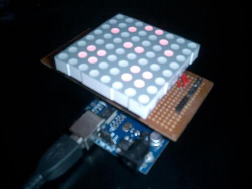
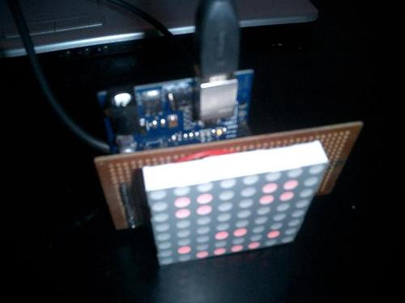
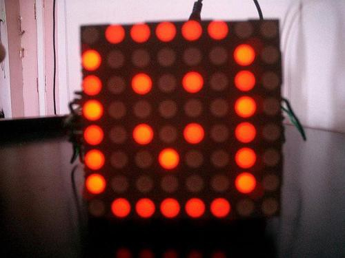
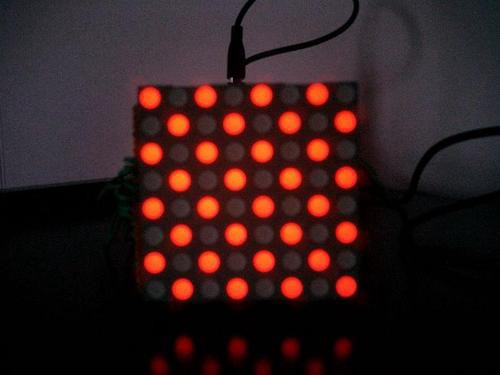
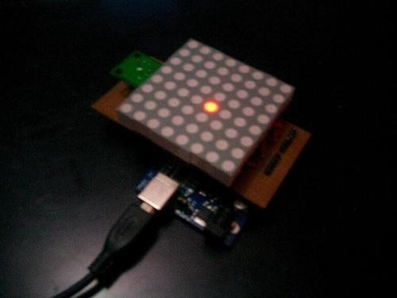

Recently I bought an 8x8 Red LED Display for Rs. 110 (\$2) from Lamington Road, Mumbai. I have connected this board to an Arduino board and an accelerometer.

This display has 64 LEDs but only 16 pins to control them. The LEDs are controlled by multiplexing them. That is each LED is refreshed one after the other like in a TV and this is done so fast that we feel like we are seeing one image. Again same as a TV or your computer CRT or TFT.

I have put up the code in a Github repository: [https://github.com/paramaggarwal/ledmatrix](http://t.umblr.com/redirect?z=https%3A%2F%2Fgithub.com%2Fparamaggarwal%2Fledmatrix&t=N2M5N2I5ZWUzYmY2NmViYjNmNjI5ZThiYTY2OTM2ZGIwYzc0MDhmMSxpSXlxUkNPSA%3D%3D)

There is a lot that can be done with the display. Here is what I could do:

Happy face:

A basic image to show on the display. This used a 2D array to store data.

This image was generated using code. Next I moved on to patterns:

<Embed src="https://player.vimeo.com/video/5378019" height={240} width={320} />

Then these two use similar code:

<Embed src="https://player.vimeo.com/video/5378084" height={240} width={320} />

<Embed src="https://player.vimeo.com/video/5378112" height={240} width={320} />

Now here is an interesting pattern. It shifts each columns of the image one step further, and the last colmumn becomes the first column. This gives a wavy pattern:

<Embed src="https://player.vimeo.com/video/5389019" height={240} width={320} />

Here is an interesting laughing animation:

<Embed src="https://player.vimeo.com/video/5389031" height={240} width={320} />

Next step was to interface the accelerometer:

<Embed src="https://player.vimeo.com/video/5391971" height={240} width={320} />

And two games based on this:

<Embed src="https://player.vimeo.com/video/5396406" height={240} width={320} />

<Embed src="https://player.vimeo.com/video/5396460" height={240} width={320} />

Now comes the interesting part, I studied the net for a bouncing algorithm and this is what I could make:

<Embed src="https://player.vimeo.com/video/5404756" height={240} width={320} />

Now I took this algorithm further and made a game out of it:

<Embed src="https://player.vimeo.com/video/5419056" height={240} width={320} />

Finally a complete game with scores _et all_.

The game is simple, tilt the board to control the ball and break the bricks. Once you break all the bricks, it shows you the scores by drawing as many bricks as your score. The score depends on the time you took to complete the game.

Github repository: [https://github.com/paramaggarwal/ledmatrix](http://t.umblr.com/redirect?z=https%3A%2F%2Fgithub.com%2Fparamaggarwal%2Fledmatrix&t=N2M5N2I5ZWUzYmY2NmViYjNmNjI5ZThiYTY2OTM2ZGIwYzc0MDhmMSxpSXlxUkNPSA%3D%3D)
