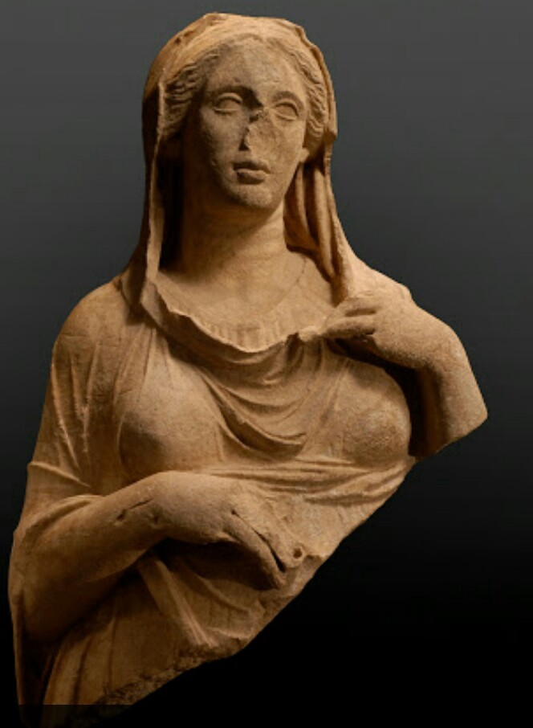

 on [Unsplash](https://unsplash.com/?utm_source=unsplash&utm_medium=referral&utm_content=creditCopyText)](./asset-1.jpeg)

## Being wrong is better than _staying shut in the pursuit of the right_.

I take joy in being wrong sometimes — it’s my gateway to coming out as right eventually. By being wrong, I put myself in a vulnerable position and hence at the receiving end of a lot of information — more than I would be able to find if I had instead chosen to claim to be right from the start.

Intentionally saying something that I know has a high chance of being wrong allows others to immediately jump to correcting me and hence fill in the gaps in my understanding in the most efficient way possible. By being so visibly and obviously wrong, the amount of effort someone needs to correct me with the exact piece of missing information is trivial.

Let’s speak with a metaphor — say you are building a sculpture but you don’t know how to make a human nose on your otherwise beautiful sculpture.

You have two options:

1.  Not make a nose at all because you were busy asking for help.
2.  Make it in the best way you can. But you can immediately see that it’s wrong.

Now consider the difference between the two:

1.  In the first option you may reach out to the best sculptors on how to correctly make a nose and they get back to you saying they do not have time to help you.
2.  In the second option, people like your sculpture but can’t bare to see the crooked nose and immediately offer tips on how to correct it or even offer to correct it for you.

Human phsychology has a basic rule — it’s always easier to edit something than create something. This is why so many writers struggle with a blank piece of paper, artists struggle with a blank canvas and programmers struggle with a blank editor screen.

Extending from this basic concept, it is always easier for someone to correct you than actually answer your question from scratch.

---

It’s not that you are being sinister here. Asking a question is ineffective because the other person has no context of how much you understand — they need to lay out the context for you first. But by simply saying what you know, it is easy to point out which assumptions are wrong and will eventually help you be right.

Hence, while a lot of people out there are concerned with being always right and never wrong — I believe a meaningful approach is focussing on speaking what you know. Others will instinctively fill in the gaps for you.

It’s about starting from scratch vs. starting with a hypothesis. By always having something on the table you give others the option to shape the discussion and everyone learns.

Next time you are in a discussion, don’t be afraid of contributing the nose to the sculpture on the table —even if you immediately know you did it wrong, someone will fix it for you, but if you never contribute then it might never exist.

---