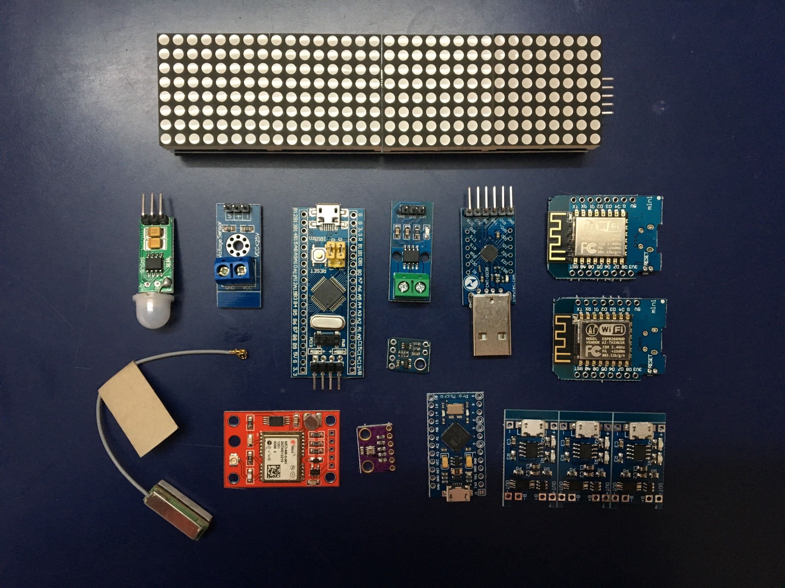

## Physical computing — the fascinating world of Arduino, ESP8266 and STM32. I’ll be sharing my projects and also fun mailbag videos of stuff I am experimenting with.

Eight years ago I bought an Arduino Deicimila along with a costly MEMS accelerometer module and my journey began. Along the way, I [made](https://medium.com/@paramaggarwal/building-a-wifi-twitter-display-scrolling-tweets-7788d20ffbd3#.8va7t05f6) [many](https://medium.com/@paramaggarwal/switching-a-light-bulb-with-an-arduino-adb848d76e84#.jen0f13sk), [various](https://medium.com/@paramaggarwal/using-an-led-matrix-module-91b59250ab21#.bujz45kua), [lots of](https://medium.com/@paramaggarwal/pov-display-with-accelerometer-62c91c49bf56#.to00cjqt5) [different](https://medium.com/@paramaggarwal/interfacing-a-feature-phone-display-204a820d842#.j6aa73hao) [projects](https://medium.com/@paramaggarwal/wireless-link-using-nordic-nrf24l01-modules-45655c27c453#.jqbmrefwi) and documented them. Till today, I did this by writing about them and sharing a few pictures. From now on, I am making videos instead. Videos enable a much richer and engaging learning experience for the viewer.

Recently I upgraded my Arduino to the latest one, and got to talk about the vast difference that has happened in the past 8 years in the world of Arduino. Even though the size of the board remains the same, the amount of empty space on the board is vastly increasing.

Episode 1

Most of my exposure to electronics has been via Sparkfun, which requires importing things from the US. Sparkfun products are high quality and very well documented.

A few weeks back, I was introduced to the world of cheap chinese electronics on AliExpress, and I was hooked. I placed a ton of orders and they have now started showing up. Which means I get to make my first mailbag video!

Episode 2

Links to items mentioned in the video are below. This was my very first batch of orders from AliExpress and also my first mailbag video. It’s amazing how affordable and accessible all these modules and sensors have become.

1\. WeMos D1 mini clone based on ESP8266 [https://www.aliexpress.com/item/1pcs-D1-mini-Mini-NodeMcu-4M-bytes-Lua-WIFI-Internet-of-Things-development-board-based-ESP8266/32644199530.html](https://www.aliexpress.com/item/1pcs-D1-mini-Mini-NodeMcu-4M-bytes-Lua-WIFI-Internet-of-Things-development-board-based-ESP8266/32644199530.html)

2\. TP4056 Lithium Battery Charger and Protection Module [https://www.aliexpress.com/item/1PCS-5V-1A-Micro-USB-18650-Lithium-Battery-Charging-Board-Charger-Module-Protection-Dual-Functions-TP4056/32467578996.html](https://www.aliexpress.com/item/1PCS-5V-1A-Micro-USB-18650-Lithium-Battery-Charging-Board-Charger-Module-Protection-Dual-Functions-TP4056/32467578996.html)

3\. JST connector pairs [https://www.aliexpress.com/item/5pairs-150mm-JST-male-female-connector-plug-cable-DIY/32478080502.html](https://www.aliexpress.com/item/5pairs-150mm-JST-male-female-connector-plug-cable-DIY/32478080502.html)

4\. Breadboard wires [https://www.aliexpress.com/item/40pcs-lot-10cm-2-54mm-1pin-feMale-to-Male-jumper-wire-Dupont-cable/32241687157.html](https://www.aliexpress.com/item/40pcs-lot-10cm-2-54mm-1pin-feMale-to-Male-jumper-wire-Dupont-cable/32241687157.html) and [https://www.aliexpress.com/item/40pcs-lot-10cm-2-54mm-1pin-Male-to-Male-jumper-wire-Dupont-cable/32241729263.html](https://www.aliexpress.com/item/40pcs-lot-10cm-2-54mm-1pin-Male-to-Male-jumper-wire-Dupont-cable/32241729263.html)

5\. NEO6M GPS Modules [https://www.aliexpress.com/item/GY-NEO6MV2-NEO-6M-GPS-Module-NEO6MV2-with-Flight-Control-EEPROM-MWC-APM2-5-large-antenna/32654502054.html](https://www.aliexpress.com/item/GY-NEO6MV2-NEO-6M-GPS-Module-NEO6MV2-with-Flight-Control-EEPROM-MWC-APM2-5-large-antenna/32654502054.html)

6\. BMP280 Barometric Pressure Sensor [https://www.aliexpress.com/item/I2C-SPI-BMP280-3-3-Digital-Barometric-Pressure-Altitude-Sensor-High-Precision-Atmospheric-Module-for-arduino/32681667220.html](https://www.aliexpress.com/item/I2C-SPI-BMP280-3-3-Digital-Barometric-Pressure-Altitude-Sensor-High-Precision-Atmospheric-Module-for-arduino/32681667220.html)

7\. Arduino Pro Micro ATMEGA32U4 [https://www.aliexpress.com/item/New-Pro-Micro-for-arduino-ATmega32U4-5V-16MHz-Module-with-2-row-pin-header-For-Leonardo/1814273840.html](https://www.aliexpress.com/item/New-Pro-Micro-for-arduino-ATmega32U4-5V-16MHz-Module-with-2-row-pin-header-For-Leonardo/1814273840.html)

8\. STM32F103C8T6 ARM STM32 Development Board [https://www.aliexpress.com/item/STM32F103C8T6-ARM-STM32-Minimum-System-Development-Board-Module-Forarduino/1748445137.html](https://www.aliexpress.com/item/STM32F103C8T6-ARM-STM32-Minimum-System-Development-Board-Module-Forarduino/1748445137.html)

9\. USB to UART/TTL Converter CP2104 [https://www.aliexpress.com/item/USB-2-0-to-TTL-UART-6PIN-Module-Serial-Converter-CP2104-STC-PRGMR-Than-CP2102/32279947059.html](https://www.aliexpress.com/item/USB-2-0-to-TTL-UART-6PIN-Module-Serial-Converter-CP2104-STC-PRGMR-Than-CP2102/32279947059.html)

10\. ACS712 Current Sensor [https://www.aliexpress.com/item/NEW-20A-Hall-Current-Sensor-Module-ACS712-model-20A-deal-in-all-kind-of-electrocnic-components/32712627862.html](https://www.aliexpress.com/item/NEW-20A-Hall-Current-Sensor-Module-ACS712-model-20A-deal-in-all-kind-of-electrocnic-components/32712627862.html)

11\. HC-SR505 Mini Body Sensor [https://www.aliexpress.com/item/HC-SR505-Mini-sensing-module-body-sensing-mode-mini-body-sensor-switch-NEW/32490630982.html](https://www.aliexpress.com/item/HC-SR505-Mini-sensing-module-body-sensing-mode-mini-body-sensor-switch-NEW/32490630982.html)

12\. Large 4 in 1 MAX7219 Dot Matrix Display [https://www.aliexpress.com/item/Free-Shipping-MAX7219-Dot-Matrix-Module-For-Arduino-Microcontroller-4-In-One-Display-with-5P-Line/32597603008.html](https://www.aliexpress.com/item/Free-Shipping-MAX7219-Dot-Matrix-Module-For-Arduino-Microcontroller-4-In-One-Display-with-5P-Line/32597603008.html)

13\. Voltage Sensor [https://www.aliexpress.com/item/NEW-Voltage-detection-module-Voltage-sensor-Electronic-blocks-For-arduino-Free-Shipping/1902992012.html](https://www.aliexpress.com/item/NEW-Voltage-detection-module-Voltage-sensor-Electronic-blocks-For-arduino-Free-Shipping/1902992012.html)

14\. Itead Sonoff WiFi Smart Switch [https://www.aliexpress.com/item/2016-New-Sonoff-Remote-Control-Wifi-Switch-Smart-Home-automation-Intelligent-WiFi-Center-for-APP-Smart/32683636030.html](https://www.aliexpress.com/item/2016-New-Sonoff-Remote-Control-Wifi-Switch-Smart-Home-automation-Intelligent-WiFi-Center-for-APP-Smart/32683636030.html)

15\. VL53L0X Laser Ranging Sensor [https://www.aliexpress.com/item/GY-530-VL53L0X-World-smallest-Time-o-f-Flight-ToF-laser-ranging-sensor/32728828965.html](https://www.aliexpress.com/item/GY-530-VL53L0X-World-smallest-Time-o-f-Flight-ToF-laser-ranging-sensor/32728828965.html)

See you in the next video!