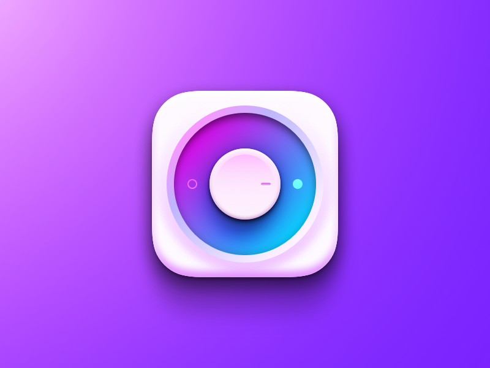
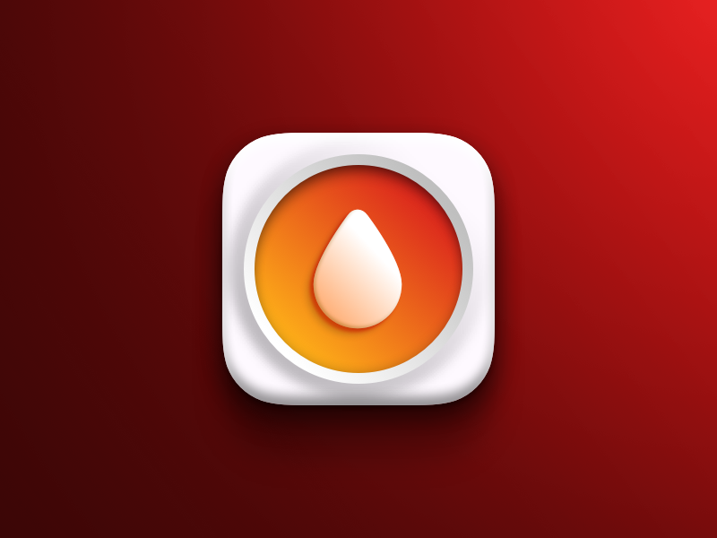
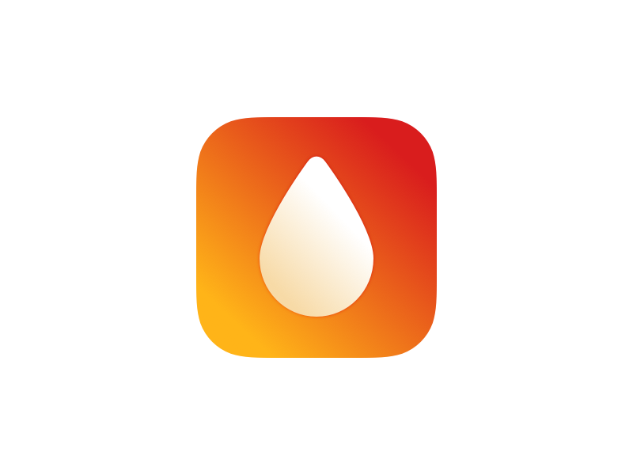
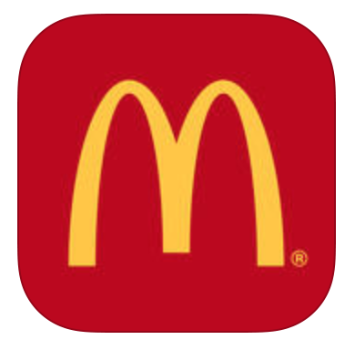
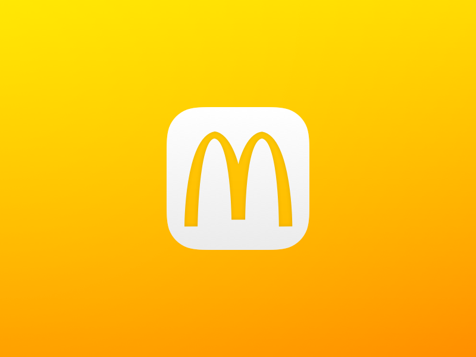

## I spent an hour on a Sketch tutorial and next, I was churning out polished app icons. It’s so easy to get started.

Designing icons is challenging, because there is very little space. They are so tiny. You can’t explain in words and you can’t draw a picture. It has to be something one can quickly associate with.

But an app icon, in contrast to a simple icon, allows the use of colour and gradients. There is much room for creativity and expression. Sketch is generally so well praised in the circles, that I decided it was time to explore it! I found this tutorial by Sebastien Gabriel.

[**Sketch Tutorial**  
_A step by step tutorial to discover Sketch._medium.com](https://medium.com/p/b76271a095e3 "https://medium.com/p/b76271a095e3")

He teaches the basics of the vector tools available in Sketch in a highly practical manner. I spent a few minutes skimming through and then fired up a trial version of Sketch that I found here: [http://www.sketchapp.com](http://www.sketchapp.com)

I deligently followed the steps, trying to be faithful to the tutorial, because I really liked the icon he makes in the tutorial. I wanted to make sure I am able to reproduce the same — and I succeeded!

It is hard to explain the joy of seeing something beautiful, and feeling that you could never make something like it — but then going ahead and actually making it.

Following the steps in the tutorial exactly as mentioned allowed me to gain this confidence. It was time to go exploring myself. I started tweaking the different values like the colour gradients and the vector shapes — and arrived at this icon, which looks very different, but has elements of the original icon.

Again, a large boost of confidence. This is something truly unique and I absolutely loved it. Though it has elements of the original icon, it is also sufficiently unique.

But after the initial excitement subsided, I realized that there were too many shadows for my taste. How can I reduce this to it’s very essence?

With that thought, I started removing as many shadows and superficial elements I could and ended up with this icon. My confidence was re-filled — I could do this.

I felt I was ready to start from scratch on an icon. I opened up my phone and looked at the icons on the home screen. The McDonalds app caught my eye. The ® logo on the icon seemed out of place for an app icon — which other company puts it there? So I decided this would be the first icon I try to replicate.

I downloaded an image of the logo and traced it with Sketch’s bezier curves. As I moved around the control points, I discovered that there is actually a pattern to how the curves are made. I now have a lot of respect for the designer of these iconic golden arches.

I also realized how great it is that they were able to use the first letter of their name and call it the _golden arches_.

Here is my final icon!

I am delighted by Sketch, and I highly recommend anyone with a creative bent to give it a shot. Just start with the tutorial above.

---

_If you enjoyed this post, please hit Recommend!_