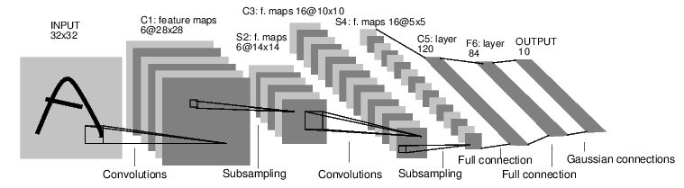
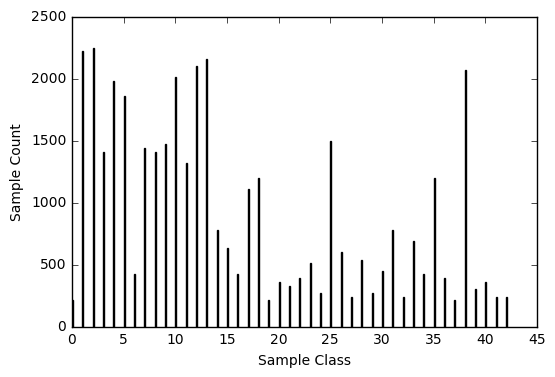

## My struggle with learning to classify thousands of traffic sign images using deep learning. In the end, the pain taught me more than the successful results.

_This is a qualitative exploration — you can also checkout the_ [_highly technical exploration_](https://medium.com/@paramaggarwal/intricacies-of-traffic-sign-classification-with-tensorflow-8f994b1c8ba) _of all the steps involved in this project. Plus, my previous project: Lane Detection using OpenCV, also has a_ [_YouTube video_](https://www.youtube.com/watch?v=a6pDdS6sY2E) _and_ [_supporting post on Medium_](https://medium.com/@paramaggarwal/my-lane-detection-project-for-the-self-driving-car-nanodegree-by-udacity-36a230553bd3)_._

Working with neural networks can be painful, not because they are bad, but because they are so new. I was sharing with a friend how it beckons to the day of developing for the web with `alert()` statements before we had in-browser debuggers! There is absolutely no qualitative visibility into how well we are doing.

But here’s the thing: it was even worse before. You had to wait days before you knew whether that tweak you made affected positively or negatively. Today thanks to AWS EC2 and GPUs, I was able to iterate quickly and learn fast.

### **Problem Statement**

We use the German Traffic Sign Classification database which is around 150MB and has around 30,000 labelled traffic signs. The goal is simple — make a piece of code that can take a new image, and determine which type of sign it is. How accurately can we do this?

Historically we would use algorithmic computer vision techniques, we would apply blurring, edge detection, manually code in the rules that make up individual signs — like some are triangular, some are circular.

This was computationally efficient, but was limited to how well we could codify our rules. It became a matter of how well we thought of what makes up a sign and what differentiates it from other similar ones. It became a competition of who writes a better algorithm and hence a game of skill.

But this approach soon hit its limits. After all the rules had been codified, the best optimizations put in, and all conflicting rules balanced — humans were still doing better than computers.

What do you do when you hit the seams of today’s technology? You revive a 20 year old technology — neural networks. In 2012, AlexNet successfully applied an architecture similar to LeNet-5 from 1988, and won the competition with a significant jump over all previous attempts. Since then neural networks have become the de-facto method of image classification.

### The Terror

Alright, so there is no code to write, right? Oops. Now there are a bazillion parameters of the network to tune. Yes, most of them are going to tune themselves as they see more and more data. But you still need to tune the correct hyper-parameters (parameters that affect other parameters) to be just right.

I started with the standard LeNet architecture. It has two convolution layers and three fully-connected layers. All input images are 32x32 in size with three channels of colour.

I decide that before trying to optimize the network itself, I’ll try to modify the input data. Here are two things I tried:

1.  The input data samples had different counts for each output class. Which is to say there were few examples of a certain type of sign and plenty of another. Like everyone else, I tried to augment the images in two ways — rotate and shift. Unfortunately, this did not improve things very much for me. At the end of the day, trying to balance this out manually (writing code instead of using neural network) is unfair and gives an inaccurate picture of the real world — which will see a certain type of sign appear more frequently than others.
2.  I tried to normalize the input range. Instead of the colours going from 0 to 255, I tried 0 to 1, -0.5 to 0.5 and 0.1 to 0.9. Though this is definitely recommended, I saw decent performance without it. I am personally against doing manual modifications to given input, more on that below.

When input augmentations didn’t work very well for me, I turned to the model itself. A crazy thought occured to me, how small can we go?

A lot of neural network tuning is about trying to reduce over-fitting by de-motivating higher weights, using dropouts etc. But my naive self thought, if I restrict the network itself, to be as small as possible, it can’t overfit by definition?

So I went down the rabbit hole of pruning the network. I removed one full convolution layer, and made the FC layers just 128, 64 and 32 in width. A magical thing happened — because the network was much simpler, it would train faster, so I could run it for a larger number of epochs. Which then meant I could push it higher over time. I touched 90% back again once I was using high convolution filter sizes.

#### Convolution Layer

With this, I learnt an important thing. Either one can use large convolution filters and get away with a single layer, or we split the network to go step by step and instead go layer by layer with smaller filter/kernel sizes. This was an important insight.

For me, instead of using a single convolution layer operating a 15x15 filter on a 32x32 image, I could use a smaller 5x5 filter in two layers — helping reduce compute a lot.

Here is my philosophy for neural networks, they need to see what we see. Trying to pre-process the data which modifies the meaning of the data defeats this philosophy. For example, changing the scale of the input data feels wrong to me because the convolution multiplication and subsequent activation should theoretically normalize it then and there — and hence not carry forward high weights into the fully-connected layer.

#### Fully-connected Layer

Here as mentioned above, I tried to go as small as possible. It means there are lesser parameters to tune, and hence faster learning. Remember, the back-propogation algorithm works step by step working backwards. So you would rather add more layers, than have the algo work harder on each layer, trying to guess so many parameters on the same layer.

I kept it small with 128/64/32 on the three layers. Here my understanding is that reducing these as they proceed, forces the model to stick to what matters and let go of what does not.

#### Hyper-parameters

We have heard a lot about learning rate, and as long as you have enough data, setting really small learning rates are always the way to go. Nothing much to tune in that case. The batch-size is an interesting one though. If you set it too small, the gradient won’t be able to make meaningful guesses on where to go next. If you set it too high, the network will see a smaller number of total gradient descent steps. A number I have seen often repeat here is 128. Start with this. The third parameter is the epoch size, this usually says more about how long you want to train the network. Ideally you should write a small if condition that checks when the accuracy stops improving and stops running.

### Conclusion

So these are my take-aways from this project. It was my date with neural networks and it seems to have gone OK. There is much much to learn still, and the initial opinions I have formed about these networks will help me fine tune my own understanding about them.

Right after the project, we were introduced to Keras, a high level framework that allows one to write the network in much much fewer lines of code. I hope we can begin to see more standard and easier ways to visualize the network while it trains and even tweak the architecture while it is training.

---

You can find all the code for this project here:

[**paramaggarwal/CarND-Traffic-Sign-Classifier-Project**  
_CarND-Traffic-Sign-Classifier-Project - Classify Traffic Signs._github.com](https://github.com/paramaggarwal/CarND-Traffic-Sign-Classifier-Project "https://github.com/paramaggarwal/CarND-Traffic-Sign-Classifier-Project")

---

_I have quit my job working on web and mobile apps to go full time into this new domain of software breaking out from the bounds of phone displays and touch-screens to actually see, hear and change things around us. It starts with cars._