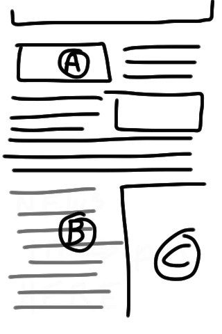
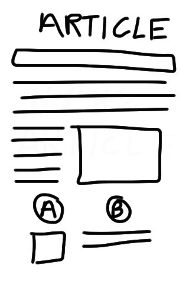
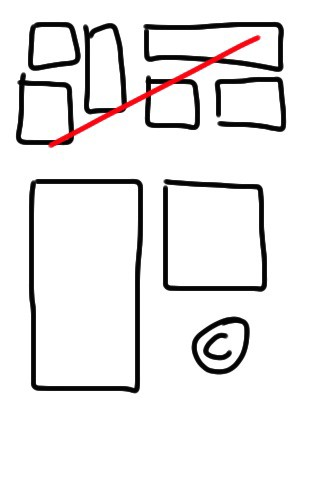
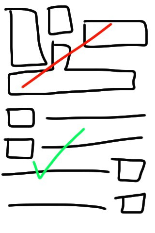

Newspapers have been what they are for many years now. New media companies start selling newspapers, but all of them have the same design. No one is trying to improve reading experience.

It’s cluttered and messy. Let’s try improving it.

**Form**:

-   The newspaper should be smaller and easier to hold. 2/3 width and height.
-   First page consists only of extremely important news in structured blocks.
-   SMS vote or comment. Email/Facebook/Twitter with short URL?
-   Large pictures (A) for the main stories with uniform standard size.
-   Bottom area contains the major headlines (B) with reference to the page number of main article.
-   Ads have fixed size options only © and there is a minimum size to ads. All small ads go in classifieds. They are not needed.

**Media**:

-   News stories that are an update to an event, will have a logo (A) so that people can easily associate it to the event.
-   This, along with text (B) specifying which category the news update belongs to.
-   Page 2 and 3 are news links classified by topic.
-   Related news should be together and categorized.
-   Atleast one infographic, excerpt, photo or cartoon of uniform size. This will add much needed color.
-   News would have a clear category/topic to suggest it as an update to ongoing news, like Google living stories.

**Pages**:

-   A full page to user contributed photos and another for nice tweets, links and articles.
-   A page for cartoons, comics and horoscopes.
-   Another page for food recipes on Saturday/Sunday.
-   There should be a ‘profile pic’ for celebrities/public figures to better relate people with the news.
-   Local news page should have more local news.
-   Sports section should have scores box and group different sports together — cricket/football etc.
-   Ad size fixed, and standard. ©

**Placement**:

-   News articles should not be squeezed together.
-   Structure is important. It makes it easy to scan through the news.
-   White space adds beauty, but today’s papers neglect it and fight against it.
-   All headlines should be same font size.
-   As we move down the page, less important news are put.

I hope someday such a paper would make it easier and faster to stay updated with the happenings in the world. Also such a paper would cost thrice of today’s paper as it is built to mimic magazine quality editorial. And that is fine.

---

_Originally published at_ [_paramaggarwal.com_](http://paramaggarwal.com/post/1021051239/redesigning-the-newspaper)_._