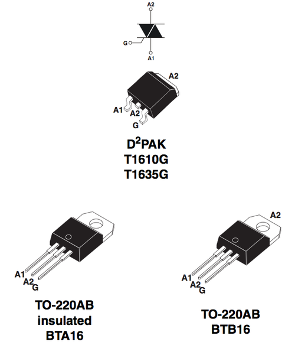
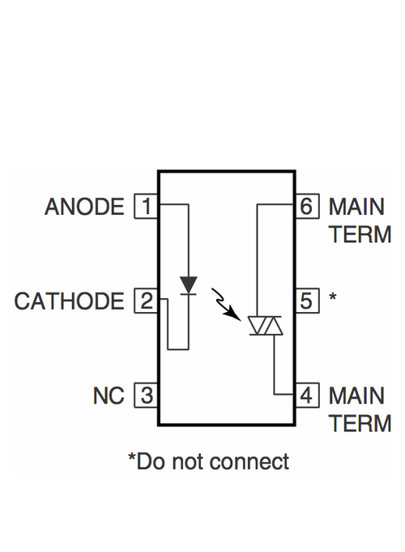
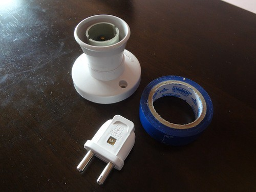
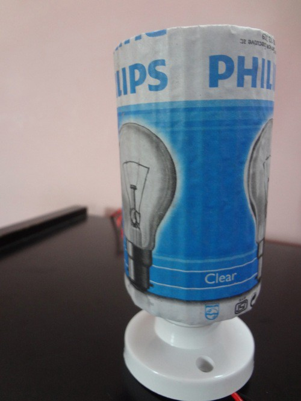
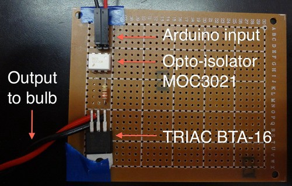
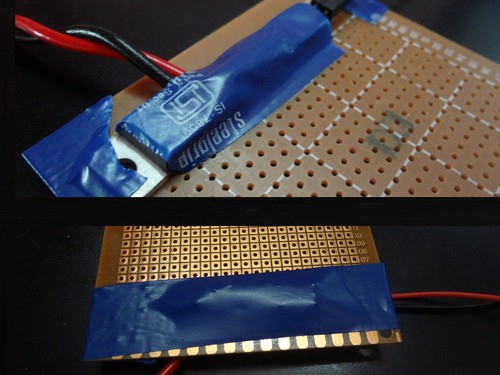

I had wanted to try this out since long. The most basic way was to use a simple relay. When the coil is energised, it pulls the contact towards itself, and establishes a connection so that the bulb can turn on. But it is noisy.

<Embed src="https://player.vimeo.com/video/47259792" height={360} width={640} />

Then I heard of Solid State Relays (SSRs). These are functionally the same but have no moving parts. Internally they consist of a [TRIAC](http://t.umblr.com/redirect?z=http%3A%2F%2Fen.wikipedia.org%2Fwiki%2FTRIAC&t=YTNjY2U0MmYwNGM5OWJhNmU4ZWNjOTNmZWUzZWRmNWM4MmJmYzY4MywxZjBSenNRZw%3D%3D) and an [Opto-isolator](http://t.umblr.com/redirect?z=http%3A%2F%2Fen.wikipedia.org%2Fwiki%2FOpto-isolator&t=YjNkOWZmYTdmMzk0Y2RmZTVhNjcyMmVjZWFjY2ZmNjdhMzM3M2ZjNywxZjBSenNRZw%3D%3D).

A TRIAC is basically the main switch, and the isolator is to keep the Arduino circuitry safe from the high supply voltage.

Caution: High voltages are dangerous. This post just describes what I did. This is by no means a guide. If you decide to do something similar, please accept that you are doing so at your own risk. Read up well and take care.

The first step is understanding these parts. Pulling up their data sheets, a TRIAC is like this:

It has two terminals where the mains supply is connected and a gate which controls it.

For the opto-isolator, at the input is a simple LED. If this is on, then the output is switched.

The combination of the two parts. Hence the Arduino is completely isolated from the mains supply.

The basics. A bulb socket, mains socket and safety tape.

The bulb I wish to take control of. It’s very bright, hence I left it inside the covering.

The circuit above, put together on a general use board.

Again, take extreme care and cover all high voltage areas with safety tape.

Now its just a matter of turning on the LED inside the opto-isolator using any device like an Arduino. Fairly simple. While the Arduino thinks it is controlling an LED, it is actually controlling a huge 60W bulb!

---

_Originally published at_ [_paramaggarwal.com_](http://paramaggarwal.com/post/29066939241/switching-a-light-bulb-with-an-arduino)_._