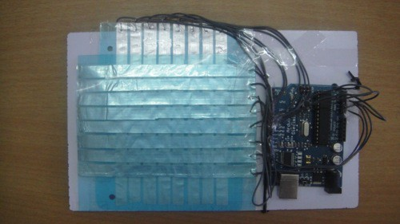
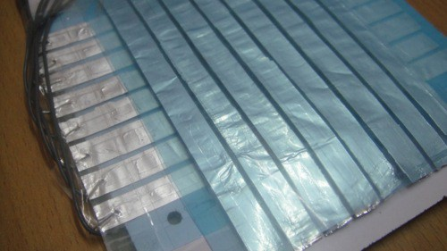
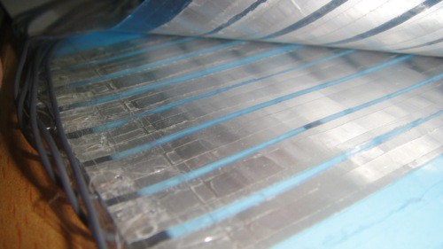
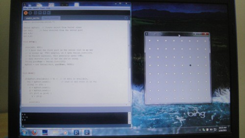

The easiest, cheapest and fastest way in which we could implement a touchpad was to use simple metal strips horizontally and vertically. When the user touches, the two strips come in contact and this is detected by a micro controller. This data is then sent to the computer.

Our touchpad.

The aluminium strips.

Tape used as insulation.

Visualization on the computer.

Materials: Aluminum foil, plastic sheets and tape.  
Software: Processing and Arduino IDE.  
Hardware: Arduino USB Board.

Code on Github: [https://github.com/paramaggarwal/touchpad](http://t.umblr.com/redirect?z=https%3A%2F%2Fgithub.com%2Fparamaggarwal%2Ftouchpad&t=YmYwODAyNDdjYTNjZTE2NDFmMTAwZmFlOTZmOWZlNmZjZDViZmE0NixtR2FpSUFQdw%3D%3D)

Made by Mukul Bharti and Param Aggarwal.
