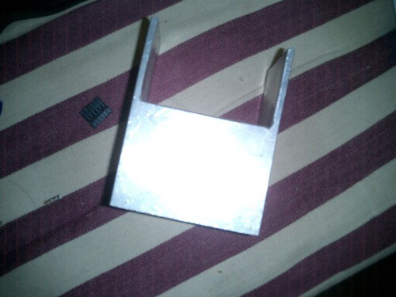
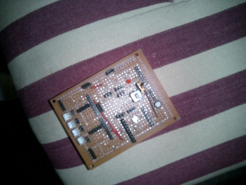
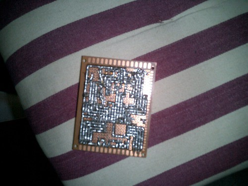
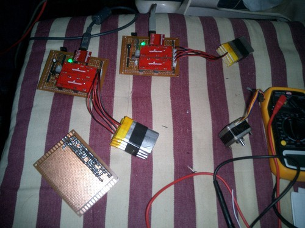
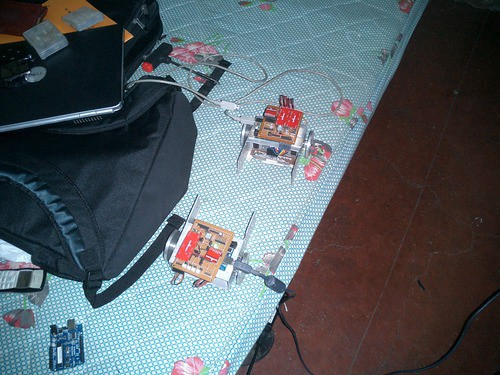
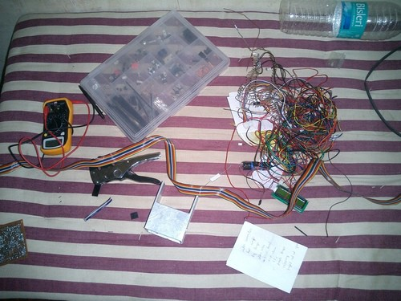

[ANTZ](http://t.umblr.com/redirect?z=http%3A%2F%2Fwww.techfest.org%2Fcompetitions%2Fibots%2Fantz%2F&t=YTY3NzJiY2ZkZmRlNjAxZTFmOTIwZGVjY2M2MjFjZDAzMTI1MjdmYyxWM3lkWGlZTA%3D%3D) is an autonomous competition that was held at Techfest 2010 at IIT Bombay. It was the first time a swarm robotics competition was held in India at this level. It replaced the famous Micromouse competition at IIT.

The objective is to make 2 bots. They should be autonomous and communicate wirelessly. They will be placed on a grid and there will be 4 sugar cubes of side 8cm. Basically these 2 _ants_ will communicate/collaborate and find/place these cubes at defined positions.

I came in touch with my school friend Rushabh Shah, in Dec 09, and we along with his batch-mate, both IITians, decided to participate in ANTZ.

We loved embedded electronics, and it was fitting to go for this competition. We worked through December, during our winter end-sem break and got the hardware ready. But I regret that we were slow and not much hardware was ready.

Then in January, I came to Mumbai to participate. Everything was quite fine till the end, until the motor drivers started blowing because of our design flaw. Anyways, here are the details:

The chasis. Cut from Aluminium. The arms are to hold the cubes.

The main board. This is what connects everything together. All boards, wires connect into this.

Bottom of the main board. Look at the amount of solder!

Here are the boards without the chasis. We are testing wireless communication. The small red board is the wireless board. The two identical long ones are drivers. And you can guess the batteries.

Here are the completed bots. One of the best hardware among the participants…

The final flaw:

> _Motor drivers on one of the bots kept blowing in the end. This was a severe design flaw. Too small motors, with large battery supply, and large payload._

Lessons learnt:

- Start early
- _Plan_ and make the right decisions
- Keep pace
- There _has_ to be a team leader who makes the final decision. Voting doesn’t work.
- Code should be easily debuggable, customizable and understandable by all team members.
- Well commented code is not just for good marks. Its practical.

What we got right:

- We used good quality parts, hence we faced less hardware issues.
- We did start early, though not early enough.
- Our hardware was one of the best. But we left too little time for software.

_Ingredients_ per bot:

- One Arduino
- Two Easydriver stepper motor drivers
- One Sharp IR sensor
- Two stepper motors
- One Nordic nRF24L01+ wireless transceiver
- Four Li-poly boards

The tools of the trade. Do we need a minimalism theory for electronics?
