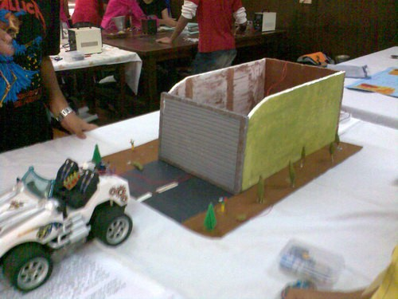
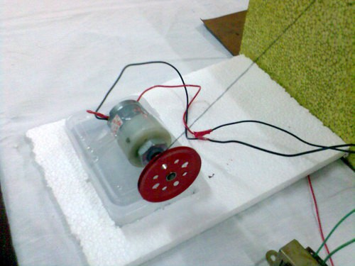
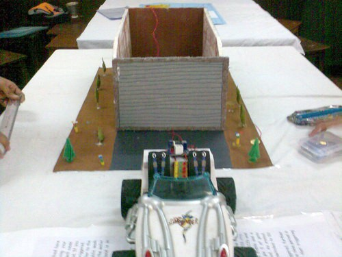
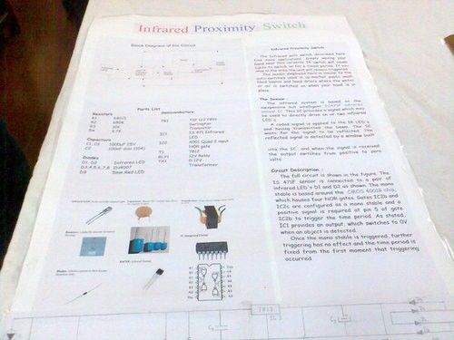
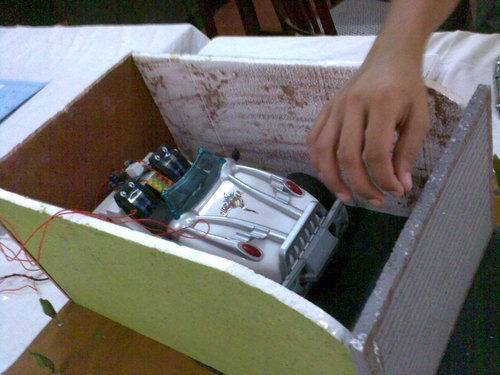
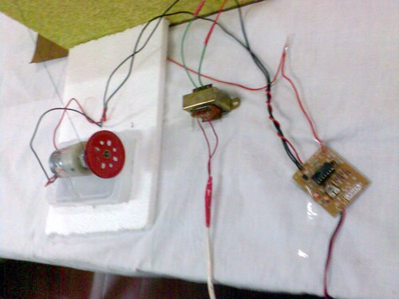
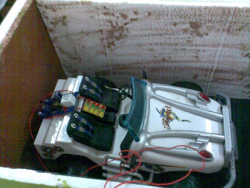

My science project in 11th std. made along with my friend Nigel Pais. We had won the second prize for this as part of a science exhibition.

This is not exactly automated as such, but what it does is that it warns us if the wall is too close while backing up. This helps us to park the car faster and without damaging it. Also there is an automatic garage door that is operated by a touch sensor.

The motor to raise the garage door. It is taped to a box with water to hold it down while it pulls the door. The box is then fixed in thermocol to keep it from moving around.

The side view of the garage. The wires go to the car to power the sensor. We didn’t use a battery as we had to keep it running throughout day, for the exhibition.

The car and the garage. Just on the right side of the door, there is agolden coin like plate; this is the touch sensor to open the garage door.

The chart to explain the project. _Technical details_.

The car parked in the garage. Here Nigel is holding the thread that pulls the garage door open.

From left, the motor to lift the garage door, power supply and the touch sensor board. The touch sensor board is a kit bought from Visha Electronics at Lamington Road, Mumbai.

Here you can see the proximity sensor at the back of the car, and the alarm system in the middle.

At that time I spent around Rs. 400 for this kit, what I didn’t know then is that the same circuit can be made for under Rs. 50. _I learnt_!

---

_Originally published at_ [_paramaggarwal.com_](http://paramaggarwal.com/post/584252880/automatic-parking-system)_._