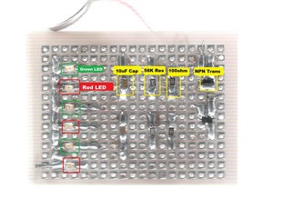
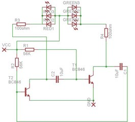

I wanted to start with SMD (Surface Mount Devices). These things are brothers and sisters of the very familiar ‘through hole’ components we use in our engineering courses. But these through hole components are quite commonly used. So what is the fun in using them? Why not use something very tiny?

How about something that just looks like a tiny speck of dust?

So here’s what we are talking about:

Here is a [video of it on Vimeo](http://t.umblr.com/redirect?z=http%3A%2F%2Fvimeo.com%2F5000787&t=NTljYThiMDYwNTEyZWNhY2ZiZTEzYTEyY2Y4NTU5M2FjOGQ2ZGVkYyxTUmlidzNIRA%3D%3D), showing it in action.

The trouble with SMD is that they are so small that they require special PCB’s to be printed out for them.

SMD’s come in various sizes: 0603, 0805, 1206. These are actually their dimensions in fractions of an inch.

1206 is the largest size available and its still so small! Now it turns out that the spacing between the leads of the 1206 version is the same as the pads on a General Purpose PCB. So it became very easy for me to just solder then on to a general purpose PCB and make the connections from the other side.

These things are so small that you get them in minimum quantities of 100!

Here’s the schematic:

