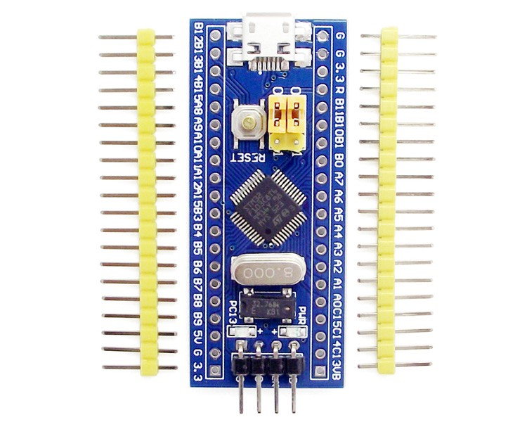
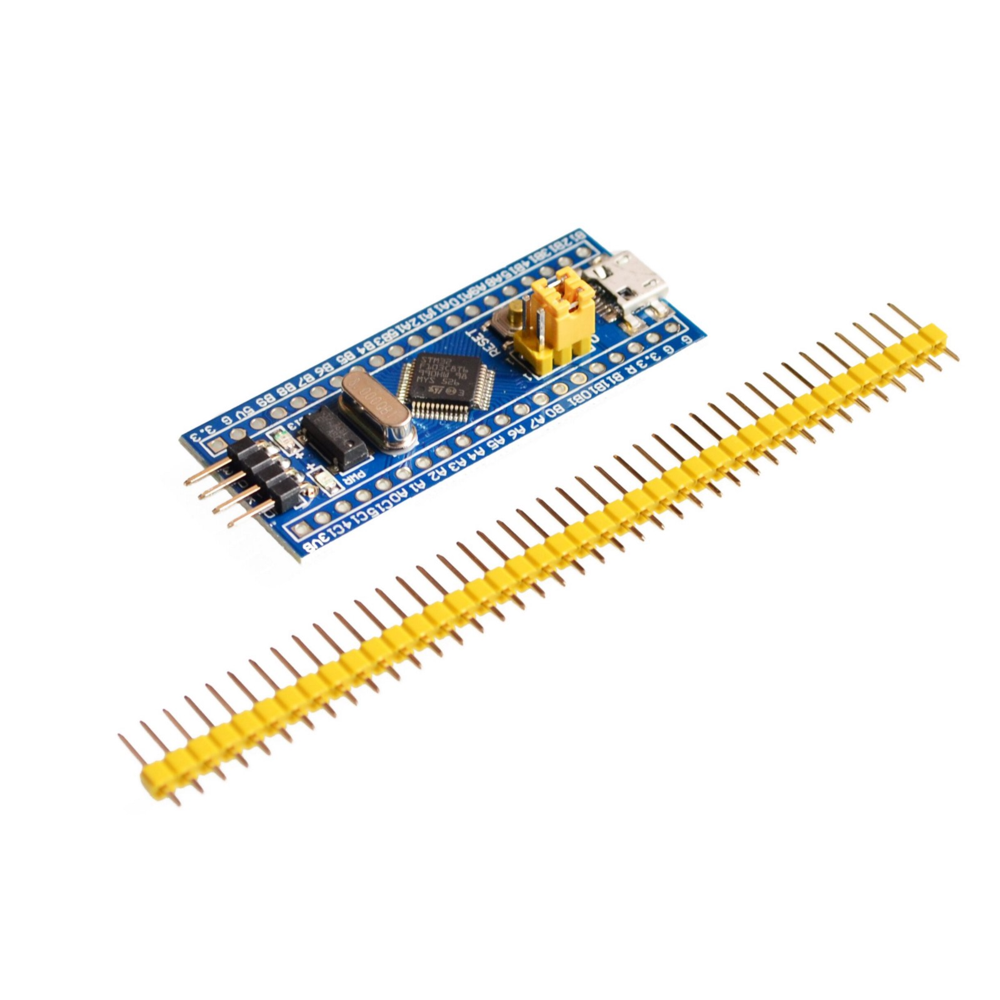

## Using the \$2 (Blue Pill) STM32 board we can have a debugger that supports breakpoints. No need of OpenOCD server, as it runs a GDB server on chip directly.



The bare STM32F103 board only comes with a default USART boot loader. Even though there is a USB port on the board, you cannot use it to program it because it does not have the relevant bootloader.

I got my board for less than \$2 from [Advanced Tech on AliExpress](https://www.aliexpress.com/item/STM32F103C8T6-ARM-STM32-Minimum-System-Development-Board-Module-Forarduino/1748445137.html?spm=2114.13010608.0.0.lSeZxD). We need to use a simple USB to UART converter to program the board via USART with a USB boot loader, and then we can get back to programming it directly via USB.

First, connect your USB to Serial/UART/TTL Converter like this:

)](./asset-2.png)

In the image above, you see two yellow jumpers marked `BOOT0` and `BOOT1`. These specify the source of code for the micro-controller. In the default state of both being `0`, the micro-controller uses its own flash memory bootloader — which there is none right now — and which we are adding. For now, to be able to program the micro using USART, you need to set `BOOT0` as `1` and leave `BOOT1` to `0`. Basically move the first jumper and leave the second one.

Now, download the [stm32loader](https://github.com/jsnyder/stm32loader) python script and run it to see that all the necessary dependencies are satisfied. I had to `pip install pyserial` to get it to work.

Now we need the binary that we want to flash as the BMP DFU bootloader — we’ll clone and compile the repo from the Black Magic Probe source. Get the toolchain `brew cask install gcc-arm-embedded`.

1.  Clone [this repo](https://github.com/blacksphere/blackmagic). `git clone git@github.com:blacksphere/blackmagic.git`
2.  Run `make`, to get the right git submodules. Ignore any errors that might occur. Remove the `-Werror` flag from [this line](https://github.com/blacksphere/blackmagic/blob/master/src/Makefile#L13), if you get a warning that is thrown as an error.
3.  Go into `cd src` and run `make clean && make PROBE_HOST=stlink`.
4.  You should get two files in the src directory — `blackmagic_dfu.bin` and `blackmagic.bin`.

Once we have the DFU file, now we simply need to run the following (after adding the correct port and file reference):

```
python ./stm32loader -p /dev/tty.SLAB_USBtoUART -e -w -v src/blackmagic_dfu.bin
```

You might need to hit reset button before you run the above to get it to work. The verification step will read back the flashed binary and compare. Reset the boot setting jumpers back to default of both`0`.



Now we are ready to add the Black Magic Probe firmware. Disconnect everything and use the USB to connect. Verify that your computer recognises the device using `dmesg` or by going to About This Mac > System Report > USB. You can also use `system_profiler SPUSBDataType`. (The hardware and software that we get to work on above are all thanks to the excellent folks at [1bitsquared](http://1bitsquared.de/products/black-magic-probe).)

For the actual firmware, we’ll use the official steps. Install `brew install dfu-util` and then follow [these steps](https://github.com/blacksphere/blackmagic/wiki/Upgrading-Firmware). Basically run \``dfu-util -d 1d50:6018,:6017 -s 0x08002000:leave -D blackmagic.bin`. Here, the device address can be found in `dfu-util -l`, and the file is the one we had generated from compilation. You should see a progress indicator and finally upload should succeed.

Now unplug and plug in your new Black Magic Probe. You should see the Firmware Upgrade DFU in `dfu-util -l`. Also, you should see new ports `ls -l /dev/cu.usbmodem*`. The first one is a GDB server and the second one is a Serial UART for debugging.

Make the connections between your target and new BMP debugger as follows. (In case these pin mappings change in the future — check [here](https://github.com/blacksphere/blackmagic/blob/master/src/platforms/stlink/platform.h). Check the values set in code, and [not the comment](https://github.com/blacksphere/blackmagic/pull/180).)

```
TARGET          DEBUGGER
GND             GND
SWDIO           PB14
SWCLK           PA5
POWER           3.3V
```

Black Magic Probe supports both JTAG/SWD and Serial/UART debugging simultaneously. So here is the pinout of that, once you get around to using it. Remember that RX/TX lines are interchanged from source to destination.

```
TARGET          DEBUGGER
RXD             PA3
TXD             PA2
```

Now connect to your board with `arm-none-eabi-gdb -ex "target extended-remote /dev/cu.usbmodemC4D1BC01"`. Add the correct port name. You should see the debugger ready for commands.

Commands like `monitor swdp_scan` should show you info about target hardware and `att 1` should attach the debugger to the target. Now you can uploade new firmware to target as well as set breakpoints etc.

For further command refer to the GDB manual or to [Black Magic Probe Documentation](https://github.com/blacksphere/blackmagic/wiki/Useful-GDB-commands).

---

Follow me to know about my future projects. Thanks to [this article](http://embdev.net/articles/STM_Discovery_as_Black_Magic_Probe#Building_Firmware_for_ST_Link_V2_Clones_and_Flash_Using_Two_Cheap_Clones) for getting me up and running with the above steps. It is based on work by [Roger Clark](https://github.com/rogerclarkmelbourne).
