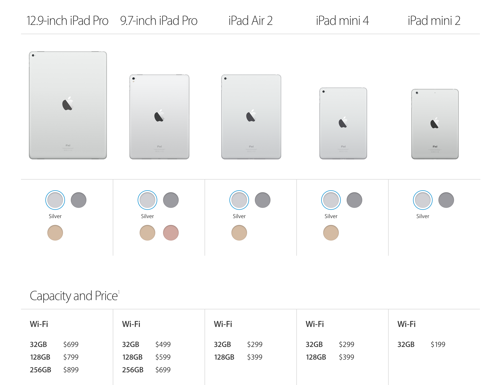
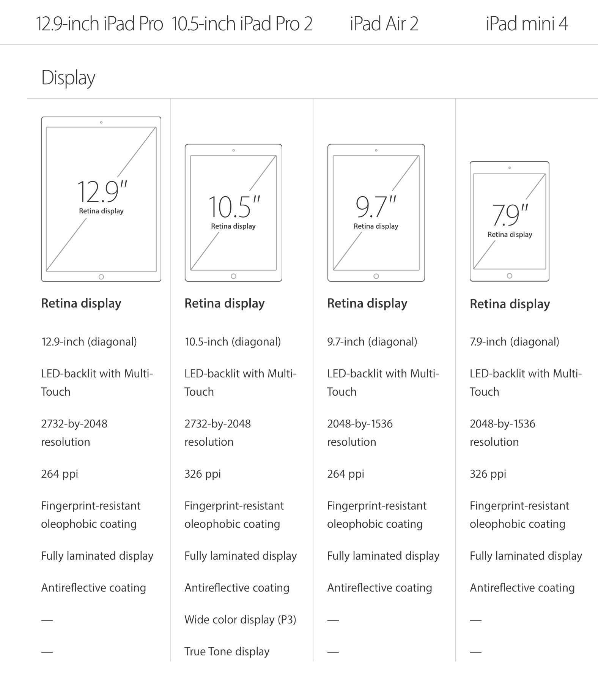

## A gentler approach to how Apple might update the iPad line-up by the end of this year.

Today, John Gruber wrote [About That Purported 10.5-Inch iPad](http://daringfireball.net/2017/03/about_that_10_point_5_inch_ipad 'Permanent link to ‘About That Purported 10.5-Inch iPad’'), which makes good points against the rumors spreading. Here, I demonstrate how the line-up might evolve with pictures.

This month, we’ll see a silent update to the iPad line-up, without an announcement event. All iPads get a \$100 price-cut as always.

Notice the new \$199 entry-point price for iPad is now possible with the iPad mini 2 capable of offering a great experience and might become the go-to tablet for kids instead of the iPod touch.

This would mean no new iPads for now, but the pricing across the line-up is very tempting. Notice the iPad Pro 9.7" sits in the sweet spot \$499 price-point that iPad used to always be at. It is also the most capable device in the line-up.

**But, look at what happens next year:**

Apple introduces iPad Pro 10.5" in either October 2017 or March 2018. Now the iPad Pro 10.5" does to the iPad mini what the iPad Pro 12.9" did to the iPad Air. It takes the number of pixels and doubles them. Hence it is two iPad minis stacked side by side.

This means that the iPad Pro 12.9" and the iPad Pro 10.5" have the exact same resolution — just like the iPad Air and iPad mini have always had. Only the pixel densities are different.

The line-up has this sense of purpose now:

1.  Air/mini are the mainstream models with the ability to run **one** full size app at a time in portrait.
2.  Pro models run **two** full size apps while in landscape, with support for Apple Pencil.

In both cases, the difference in the device size is only a function of the pixel density and not the actual pixels.

---

_Do you agree? Does this seem like something Apple might do? Let me know in a response below, otherwise please hit Recommend!_
