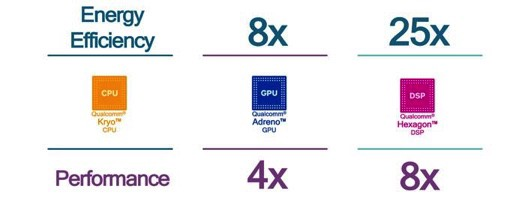

In Qualcomm’s Neural Processing Engine SDK for the Snapdragon series, they [mention](https://www.qualcomm.com/news/snapdragon/2017/01/09/tensorflow-machine-learning-now-optimized-snapdragon-835-and-hexagon-682) the use of their Hexagon DSP and claim better performance than GPU!

The metrics above [they say](https://www.qualcomm.com/news/snapdragon/2017/01/09/tensorflow-machine-learning-now-optimized-snapdragon-835-and-hexagon-682) are on the Google Inception model. This makes me curious – what’s going on here?