_The next Myntra Hackday is scheduled for April 2016. Follow Myntra Engineering on Twitter to be in the know!_ [_@myntra_engg_](https://twitter.com/myntra_engg)

---

Last year, we did our first open Hackday, and we called it Hackerramp!

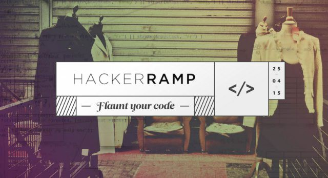

Hackerramp, Myntra’s first open hackathon happened on the weekend of April 25–26 2015. Thanks to all the 180 participants who made this event a grand success. We had around 35 teams presenting their amazing hacks to the Jury.

The goal was simple — make the next big thing in mobile. Be it an app, an API or even something related to mobile security. For more than 24 hours, keeping themselves fuelled on Red Bull, the teams raced the clock and converted their ideas into real working demos.

### Preparations

Myntra had done a Hackday in the past, but this was the first time we opened to everyone, which meant we had to get this right. There was a lot of preparation put in. There had to be great food throughout the day, great talks to kick off the event and some great goodies for the participants to take home!

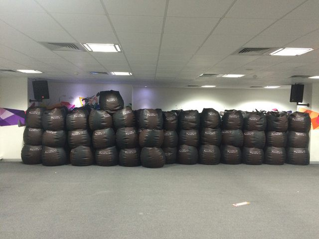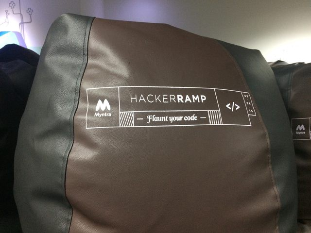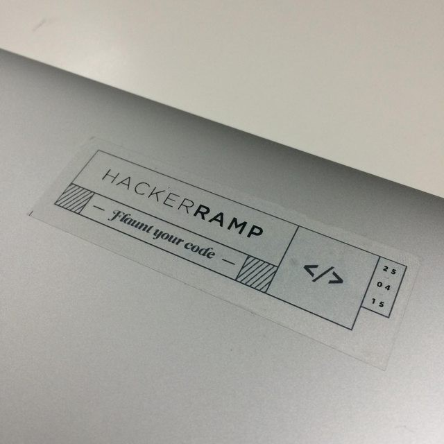

### Talks

We had three talks:

- Shamik Sharma spoke about the new possibilities coming out of the mobile emergence.
- Punit Soni spoke about his move from US to India and his experience at Google and Motorola.
- Sunil Pai spoke about recent trends and changes in programming — introducing Reactive Programming to the audience.

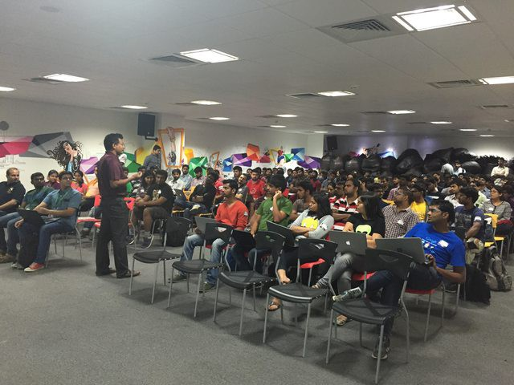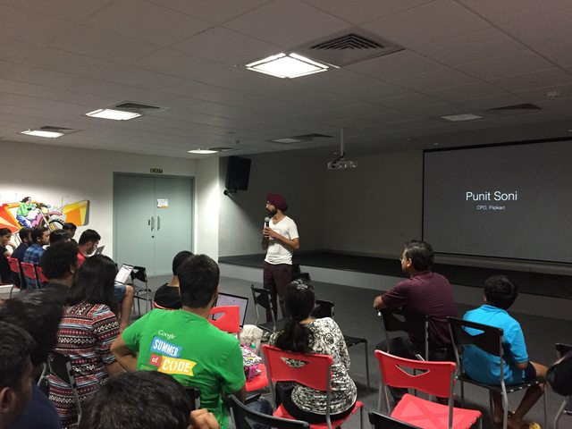

### Hacking

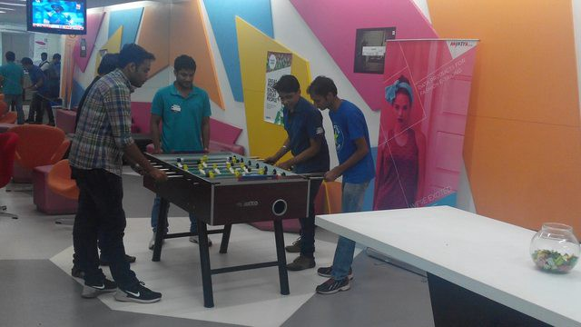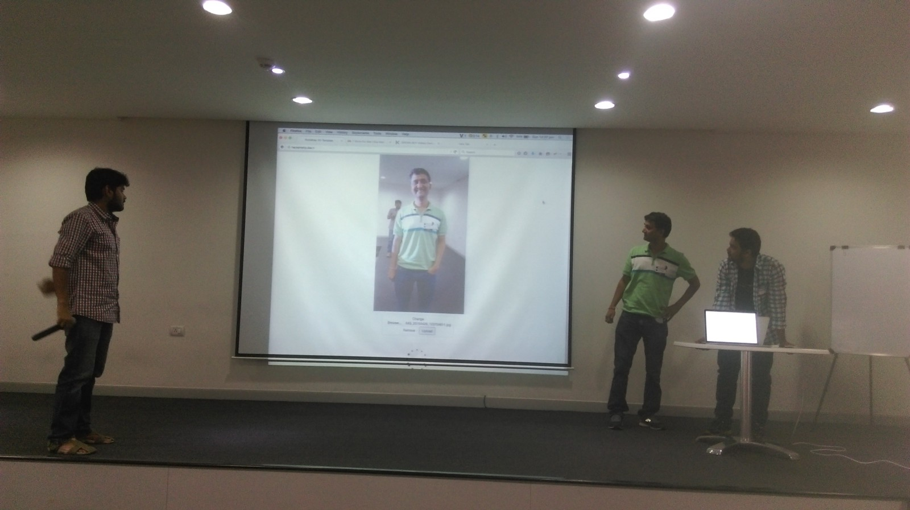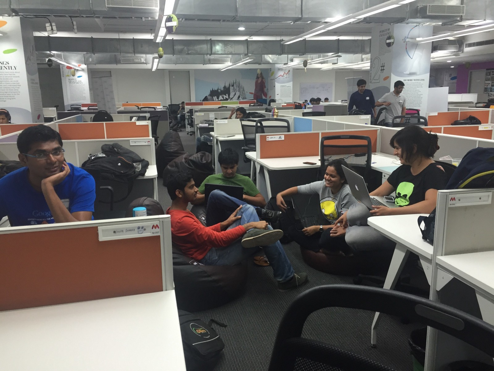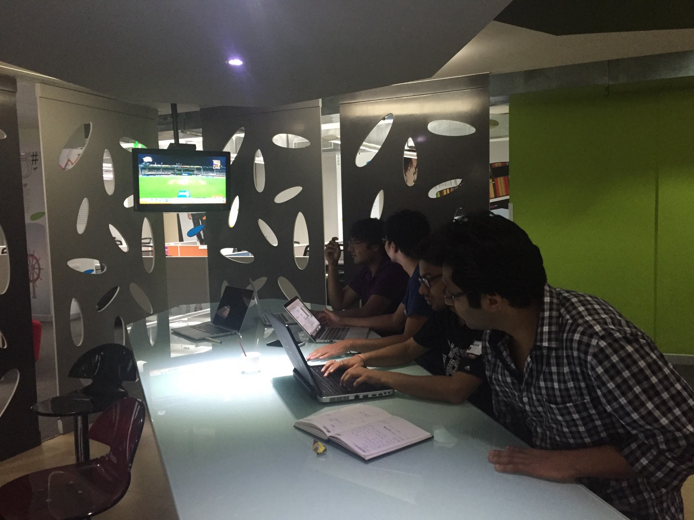

### Jury

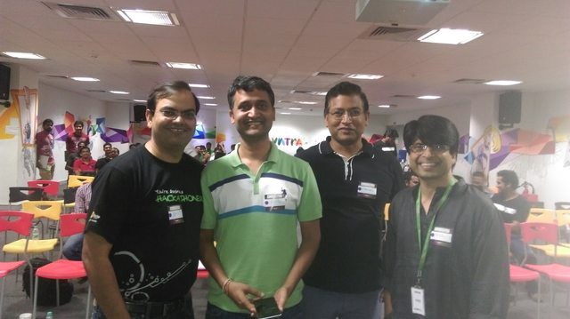

We had an amazing panel judge the teams (from left to right):

- Amit Somani — Ex CPO, MakeMyTrip
- Amod Malviya — CTO, Flipkart
- Shamik Sharma — CTO, Myntra
- Pramod Varma — Chief Architect, Unique Identification Authority of India

### Prizes

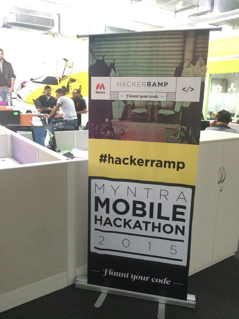

When you have 35 highly-driven teams competing for a prize bucket of 3,00,000 rupees, you know they Jury is going to have a hard time deciding. So hard, that they actually announced four winners!

1.  Chat based commerce (Daredevils): Himadri, Jatin, Vijay amd Mohan from Hike. They are part of Hike’s iOS team. Prize: Rs. 1,50,000.
2.  Chat with friends realtime to buy products (Fashion Friends): Nikhil Bansal, Anurag Saxena, Shivam Gupta & Neera Singh. They are from Flipkart, Marketshare, Vizury and Parcelled. Prize: Rs. 75,000.
3.  Augmented Reality Shooting Game (Massacre): Nilesh Hiray and Naveen Reddy from Myntra. Prize: Rs. 50,000.
4.  Smart Links (The app that links all other apps): Niketh and Niteesh. They are from Yahoo ad Fungru. Prize: Rs. 25,000.

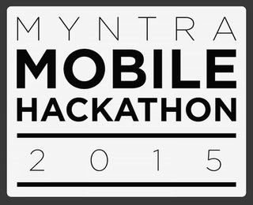

Thank you for coming and see you again next year!
