_Featured by_ [_Hack N Mod_](http://t.umblr.com/redirect?z=http%3A%2F%2Fhacknmod.com%2Fhack%2Fdirt-simple-pov-led-display%2F&t=MWVkNzFhMWE1YWVkZmJjNzY0NWI2NWNiZWRiNGNlMjQ2Yzk4MTlkYSw5eVVqcjZNRw%3D%3D) _and_ [_Make: Blog_](http://t.umblr.com/redirect?z=http%3A%2F%2Fblog.makezine.com%2Farchive%2F2008%2F10%2Farduino_minipov_with_acce.html&t=ODIwYWMyNjQ1MDMyMWZlNjQwNDYzZDQ1NTk2MDFjNmFkYWFkNmNhZCw5eVVqcjZNRw%3D%3D)_._ _Also posted on_ [_Arduino Forum_](http://t.umblr.com/redirect?z=http%3A%2F%2Fwww.arduino.cc%2Fcgi-bin%2Fyabb2%2FYaBB.pl%3Fnum%3D1223449559%2F13%2313&t=YjAwMjMxYTgyMjQzN2I2MWViMzRlMGY2Y2UwMDNjOGQ0MWJlZjQ2MCw5eVVqcjZNRw%3D%3D)_,_ [_Sparkfun Forum_](http://t.umblr.com/redirect?z=http%3A%2F%2Fforum.sparkfun.com%2Fviewtopic.php%3Fp%3D56703%23p56703&t=YThhNmExNTI3ZGEzMTc0ZjkxZDY2NTQ0Njk1Njc2NGQzYzBjZDBlZiw5eVVqcjZNRw%3D%3D) _and_ [_Adafruit Forum_](http://t.umblr.com/redirect?z=http%3A%2F%2Fforums.adafruit.com%2Fviewtopic.php%3Ft%3D6446%23p31328&t=MzA3Yzc4NjdmN2NiOTQ5YTU2N2Q2MjBlNTk1MzQ3YmI0NmUzZTZjNCw5eVVqcjZNRw%3D%3D)_._

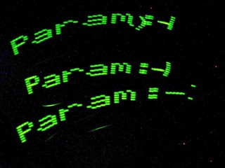

In this project I have fixed an accelerometer to a 10-segment display (it has 10 green LED’s put into a single component) and used an Arduino to control it.

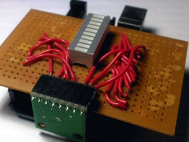

So there you have it. As you wave it, it senses this motion and switches ON the display. And one another benefit that I was really looking for is that it writes only from left to right. I mean when you wave your hand it goes left to right to left. Right? My old AccPOV was amateur enough to keep displaying text all the time left to right and back too. So that has been eliminated. And its so cool now!

I am calling it the AccPOV that is a accelerometer based Persistence of Vision Display. I really liked this idea of an Accelerometer that I got though it is commonly available on the net. Code in C++ attached. You need Arduino software to compile it.

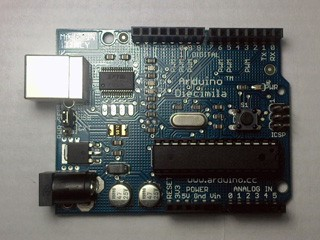

The Blue Board is the Arduino Decimelia. It programs and takes power from the USB(the grey wire).

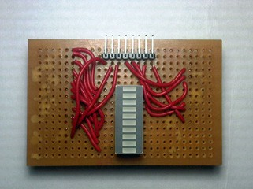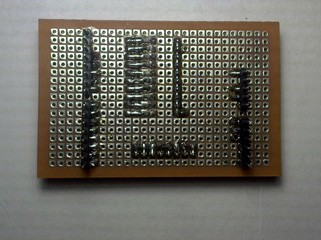

The General Purpose PCB is a ‘shield’ which is the word used for attachment boards created for the Arduino.

I have mounted the display on that.

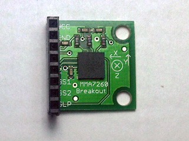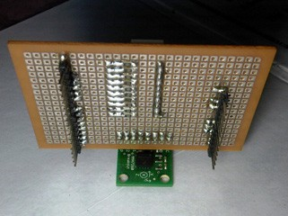

Then the tiny green PCB on the side is the Accelerometer Board. So that’s it. Took one and half day to materialize.

Next I plan to use RGB LED’s to be able to see 6 colors !! So that should be fun…

Thanks for Reading !! I know it all sounds too formal, as if I am selling something. But it’s just a discussion. A concept…

In case you don’t get the heck what I am talking about read this: This project uses Persistence of Vision. So I can use just 8 LED’s (Yes, I am just using 8 of them. ) to display text. Now as you wave it in the air, the 8 LEDs quickly change states to appear as if something is written in the air. It gives superb effect in the dark. For effect in the daylight I need very bright LEDs… So as simple as that. Just wave and read.

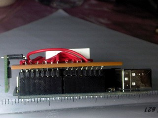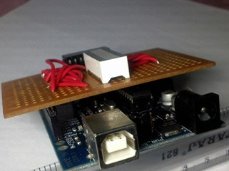

You can mail me at [paramaggarwal@gmail.com](http://t.umblr.com/redirect?z=mailto%3Aparamaggarwal%40gmail.com&t=MTM0NGY4NWIxMjcwN2EyMGEyYTFhYTNhNDcxNTMzMWJlZjY2ZTcwNCw5eVVqcjZNRw%3D%3D) for criticism and comments.

Accelerometer:

Three axis accelerometer from Freescale that gives analog voltage proportional to acceleration. You measure that voltage using a micro controller and you get acceleration!

Controller Board:

Arduino’s are so easy !! More info about them at [Arduino](http://t.umblr.com/redirect?z=http%3A%2F%2Farduino.cc&t=MmFiYTQzNWJhMDBhYjQzMzlhOGQ2MDgxOTliNmFhOGJkOGM0NjVkNSw5eVVqcjZNRw%3D%3D). It is based on the ATMEGA168 with bootloader.

Have a look at [Sparkfun](http://t.umblr.com/redirect?z=http%3A%2F%2Fsparkfun.com&t=ZTg3ZGRhZDVjMTIzYWI5YWU0MGUzNzdlMjFlNjJjZGRmNjdjZDk1Myw5eVVqcjZNRw%3D%3D) for some great electronics tutorials.

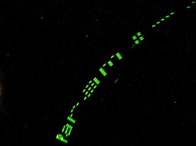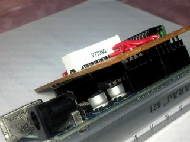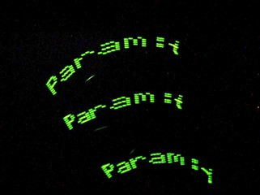

Code for Arduino: [http://github.com/paramaggarwal/movetosee](http://t.umblr.com/redirect?z=http%3A%2F%2Fgithub.com%2Fparamaggarwal%2Fmovetosee&t=OTJlNThjYzMxNWI5M2ZhNzA4NzZiNDQ2ZjViZDc1MjkwYjFmN2NjOCw5eVVqcjZNRw%3D%3D)
