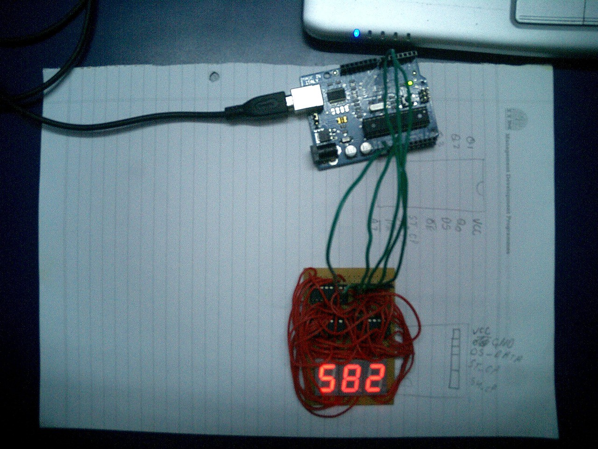

In this circuit, three single digit displays have been interfaced with the Arduino serially. I used three 74595 ICs (Serial to Parallel Shift registers) to do this. The whole aim was to learn how to use these ICs.

<Embed src="https://player.vimeo.com/video/11595574" height={240} width={320} />

Connecting them serially allowed me to use just one data wire, one clock wire, one control wire, and two supply wires. A great reduction from the 29 wires, otherwise required.

Code on Github: [https://github.com/paramaggarwal/digitdisplay](http://t.umblr.com/redirect?z=https%3A%2F%2Fgithub.com%2Fparamaggarwal%2Fdigitdisplay&t=N2I0Y2EyMzM4ZWMyMDc5ZjhkYzJkNzE5NmExMTc4MmZkMDMzNGFkZSw2Z1pqdW5wZw%3D%3D)

---

_Originally published at_ [_paramaggarwal.com_](http://paramaggarwal.com/post/584282671/in-this-circuit-three-single-digit-displays-have)_._