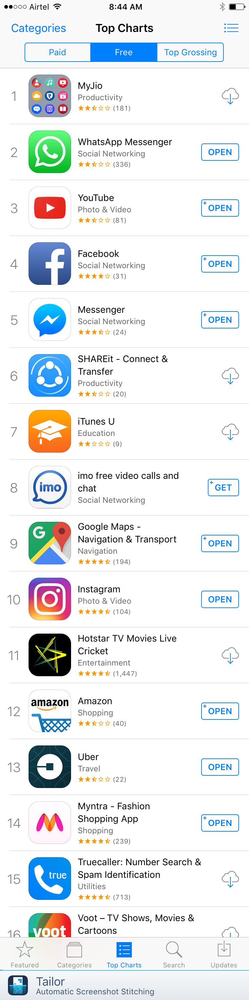
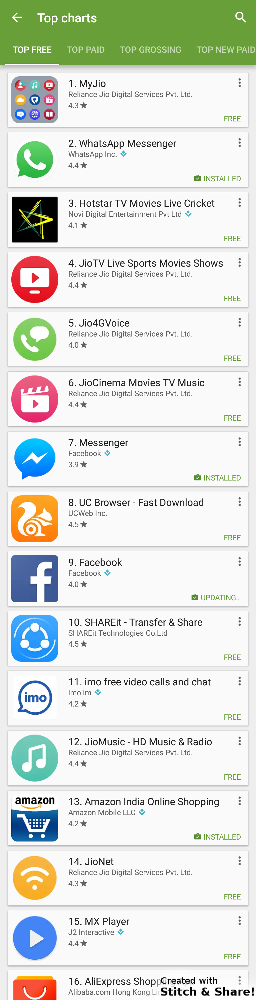

## We take a look at the top free apps on the iOS App Store in India on a normal no-sale day, to understand which apps have penetrated well into India.

Here is the list taken on a lazy Sunday Indian morning.

Let’s now go through them one by one and understand what is going on.

1.  **Reliance MyJio App**: Reliance Jio is a new cellular provider in India that has launched with a pretty big bang with a promise of free 4G data, and voice and SMS for three months till end of this year. While the Indian cellular market is very lucrative because of the sheer number of subscribers, companies see very little revenue per user on average, because the main driver for adoption is low cost. Reliance has taken this very opportunity to skip heavy investment in the corruption-prone auction of 3G bandwidth in India and is directly offering 4G(LTE) and Voice-Over-LTE service meaning that they have a substantially less total investment compared to Airtel and Vodafone who have serious investments in both 3G and 4G bandwidth. This helps Jio eventually charge roughly half the price per GB of data than competition. Plus the inaugral offer of free service means excellent marketing and adoption already. To get a Jio SIM, you need to install this app and get a unique code further pushing this app to the very top of the App Store charts for many days now.
2.  **WhatsApp Messenger**: The first of the Facebook owned apps in our list. India, Africa and generally Asia are the forte of WhatsApp. This is believed to be because of WhatsApp initial focus on being available on cheap Nokia S40, S60 phones and hence that tight network continues to exist in India. Everyone who has a phone in India has WhatsApp. If one were to safely assume which app people have installed, this would be it. It’s penetration in India is extremely deep.
3.  **YouTube**: This one comes from Google, and shows the strength of media consumption in India. On one hand we have consumers who are very conscious about their data usage and bills, while on the other hand there is a huge consumption of video. They have even worked with operators like Airtel to build a special feature into the app to save the video offline during the night when cellular data is upto twice as cheap. Many people’s sole connection to the internet in India is solely via cellular data and it’s easy to see now how the sheer number of subscribers in India multiplied by their consumption of high-bandwidth media like YouTube translates to lucrative business for Airtel/Jio as a cellular data provider and YouTube as an advertising platform.
4.  **Facebook**: Another one from Facebook. While the adoption of this app is little among the younger crowd. It is still very deeply part of the lives of citizens above 25 or so.
5.  **Messenger**: And the third app from Facebook.
6.  **SHAREit:** According to a few surveys, it is said that around 97% of the devices in India are non-iOS, open-source Android derivatives. Which means that most likely if you want to share a photo with a friend, the fastest way to do so is a quick peer-to-peer (ad-hoc) WiFi setup. This simple app allows you to do it. And is quite a necessity.
7.  **iTunes U**: I’m personally surprised to find this in the charts. The first Apple app on this list. I believe this can be a good sign that certain institutions in education are suggesting students to follow along with the courses here. Another reason I can think of is that students are installing this at the start of their new college year (July) and hence we are seeing this so high up in the charts. (Let me know below if you can think of other reasons.)
8.  **imo**: I have never heard anyone using this app, but its surprising that a large number of people are using it. What could be the reason?
9.  **Google Maps**: A necessity. Our second app from Google.
10. **Instagram**: Our fourth app from Facebook. And completes the Facebook portfolio of acquired companies. Pause and take notice on how strong the FB portfolio is. Each of their businesses are in the top 10. Extremely strong momentum. This is very popular among the younger generation below 25 or so.
11. **Hotstar**: Did I mention the consumer is price-sensitive here? But Hotstar is another video-consumption app from the parent company of Star Plus, a very famous channel here. One can watch movies, live sports and even western series like Game of Thrones. Even though Netflix is available in India, the collection is much more relevant on Hotstar and is more than twice as cheap than Netflix.
12. **Amazon:** The original. Flipkart copied the model and brought it to India (the founders were originally Amazon employees in the US.) A few years later, Amazon itself entered the country. Today though Flipkart does more volume/revenue than Amazon, the gap is closing.
13. **Uber**: The original. Ola Cabs copied the model and brought it to India. Soon Uber entered India. Again volumes of Ola are higher but the gap is closing here too.
14. **Myntra:** An Indian company acquired by Flipkart two years ago. It has a unique model of focusing purely on fashion — hence named a vertical player. While other e-commerce companies are struggling to turn profit, Myntra’s focus on high-margin fashion means that it is the only one on the verge of turning profit.
15. **TrueCaller**: Spam detection. A very real need in India.

So here are the top 15 apps and which I personally believe are indicative of the app ecosystem. It might be argued that the Play Store top charts would be a better indication given that it has a much wider user-base, I believe that looking at the iOS charts helps us see where the higher-earning segment of India is spending their time. Actually, the Play Store charts speak of a similar story:

YouTube comes pre-installed here. MX Player helps play a broader set of video formats on Android. Rest of the charts are just taken over by the MyJio suite of apps.

**Key takeaways**:

1.  India went mobile in the last 2 years and now India is coming online on high bandwidth. Video-on-demand is on the cusp of really exploding. We’ll see drop in consumption and installation of satellite-based TV installations as more and more people simply consume media via the internet.
2.  Facebook is winning. Each of their acquisitions are doing very very well.
3.  Amazon isn’t letting anyone make a profit, as itself does not make any. Uber is pushing in hard with a more polished experience, while Ola is struggling to maintain its lead. Myntra continues to sing to success.
