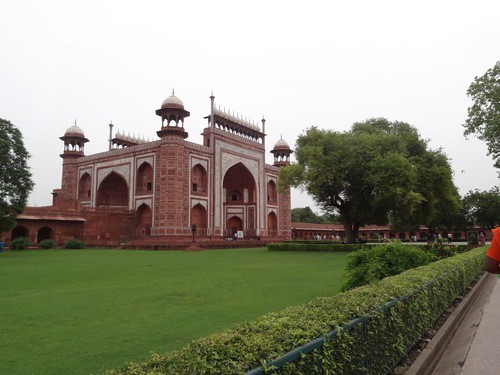
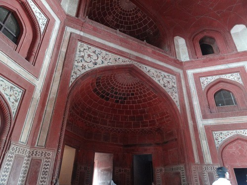
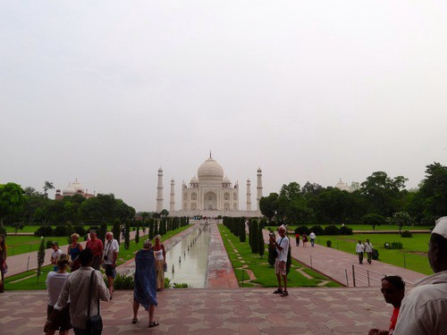
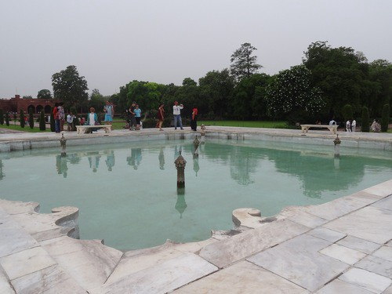
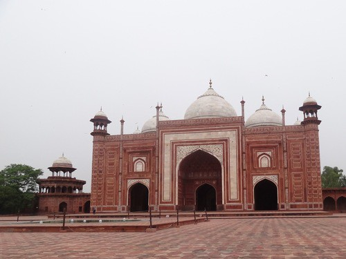
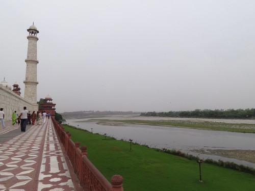
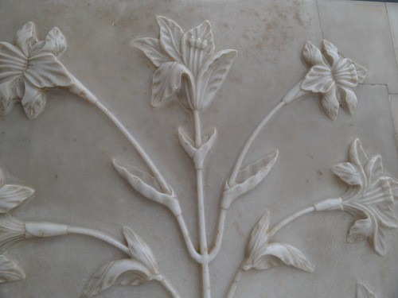
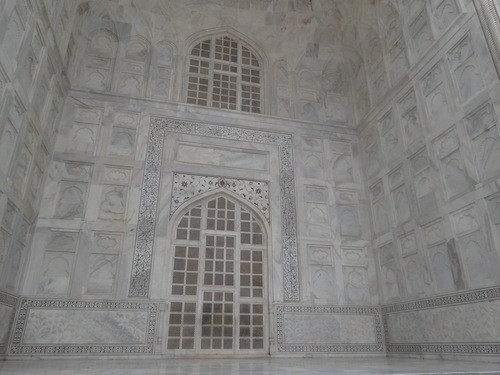
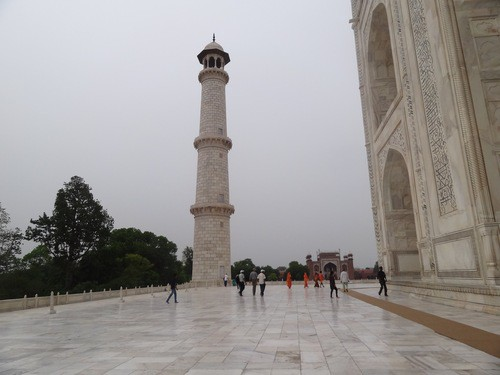
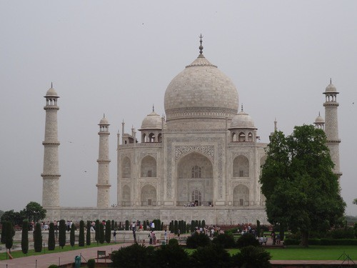

After my college presentation, I had the chance to go to Agra and see the Taj Mahal.

This is the entrance into the main area. I think this is as large as the Taj Mahal itself.

The red and white marble design is really intricate. So much detail.

And we are in! This is the first glimpse. Breath-taking.

These are the fountains in the garden leading upto the Taj. They say that these are the same since the Taj. I like the colour of the water.

On both sides of the Taj were these similar structures. One of them was for guests and the other is a mosque.

The Yamuna river behind the Taj.

Really intricate work.

Sculpted marble.

The flooring was very cool because of the marble. It felt nice here.

So much marble. So much hard work. So beautiful.
