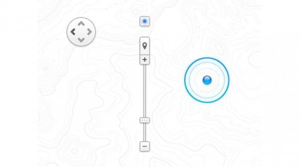
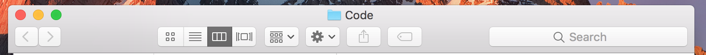

## The Mac’s form factor has always defined what it is. It can’t be an iPad/iPhone because we never hold the screen in our hand.

macOS is fundamentally driven by a point and interact model. iOS is fundamentally a direct manipulation model. This is simply defined by what part of the device we hold.

It’s painful to do tasks that require continous pointing on iOS. It’s much more easier to simply swipe and slide on iOS.

On the other hand, it is very difficult to swipe and slide using the point and interact model of macOS, because it is fundamentally driven by the concept of modes. Select one window, and you are ‘in’ it. Then select another one and you are inside that one instead.

So if both are different and both serve different needs, then how can one push macOS further? How can we do _better_?

A mouse pointer is typically used for two kinds of tasks:

1.  Select a piece of content and interact with it.
2.  Select a piece of interface and interact with it.

The display of a device solely exists for the purpose of displaying content, but how can we reduce the need of constantly moving our pointer away from the content, over the interface, select, and then move back to content to operate?

Let’s start with the most fundamental of such UI, and that is the scroll bar. Once upon a time, we moved our mouse cursor away from the page we are browsing, to the tiny bars on the side, selected them, operated them, and then returned to the content.

We solved this by bringing the scroll bars to the mouse itself. They started with scroll wheels, then touch pointers and then touch pads. Slowly we arrive at today where we never really interact with scroll bars, they just exist to give context.

](./asset-1.png)

Next, what other piece of interface can we remove that is simply taking away space from content?

When was the last time you had to interact with these buttons? Most likely, you use the pinch to zoom feature on your Trackpad and even possibly the click and drag ability of it. Gone. One more piece of interface that doesn’t require the move, interact with interface, move back, interact with content pattern. Now your mouse pointer remains on the content.

So what should Apple tackle next? What other piece of interface do we constantly need to move our mouse pointer to?

How about these guys:

Notice how much of these toolbars are just filled with buttons. It’s another familiar select and interact model of desktop computers. Another piece of interface that constantly requires moving the mouse up, away from the content for a few moments and then interacting and bringing it back on the content. So cumbersome!

What if we finally had all the technological advancements in place to fit an entire touch display in the space taken by the keys of a keyboard!

](./asset-7.png)

In 2016, we can.

---

_(Inspiration for this article came from Bret Victor’s_ [_tweet_](https://twitter.com/worrydream/status/793501946464264193)_.)_
