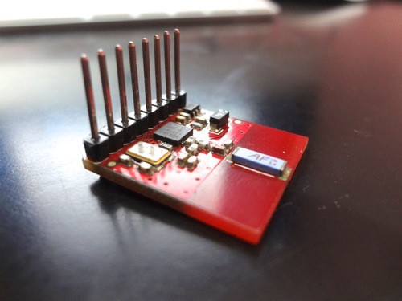
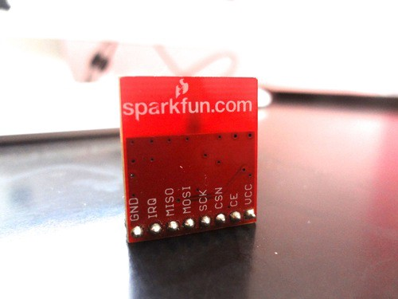
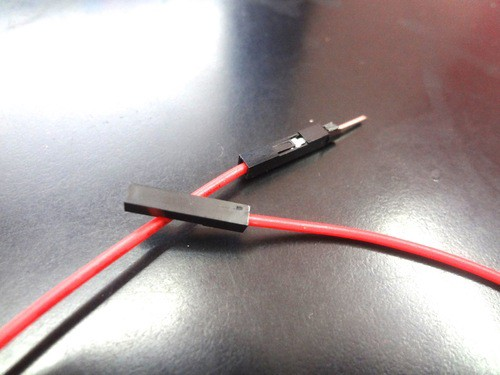
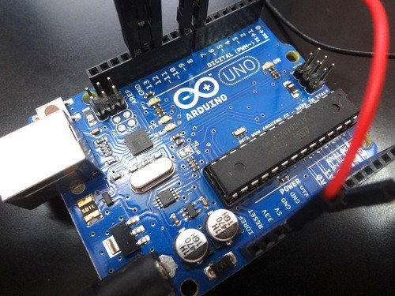
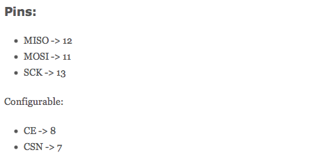
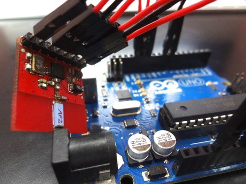
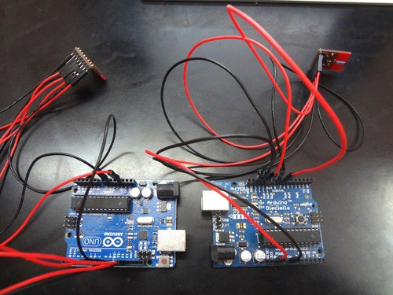
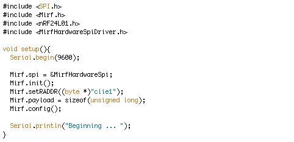
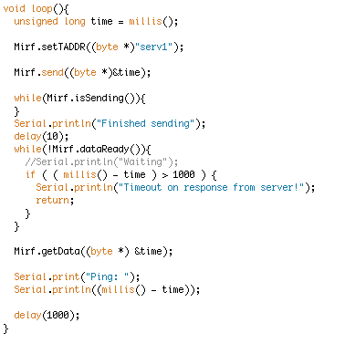
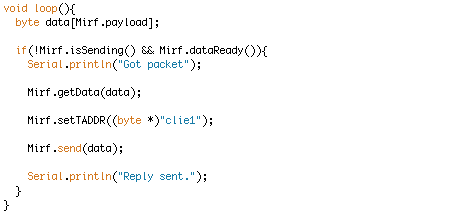

I just really like these modules. They are extremely cute. That little chip on the board is a Nordic nRF24L01+ 2.4GHz transceiver and is actually just 3x3mm. Really tiny.

I must say Sparkfun has a certain design sense of laying out boards. Really beautiful and easy to use. The pins are clearly labelled. They sell them for \$20 [here](http://t.umblr.com/redirect?z=https%3A%2F%2Fwww.sparkfun.com%2Fproducts%2F691&t=Yzg3MDNjYTk1M2EyNTJiOTkwNDY3Zjc3YWNhZmFiNWJiNTc3NGY2OSxqT0xDemNYZg%3D%3D). In India, I sell via [my site](http://t.umblr.com/redirect?z=http%3A%2F%2Fwww.feemo.in&t=MGRiMzgxMmU4NTliN2VhZWExNDhkZDdmYTEzZWU4ZmNhNmZkYWFjYyxqT0xDemNYZg%3D%3D).

They come without the header pins, so I had to solder them myself. I have started using these great jumper wires that keep things really clean. Before I used to strip wires which was very finicky.

The modules are SPI driven, and the appropriate Arduino library is also available [here](http://t.umblr.com/redirect?z=http%3A%2F%2Farduino.cc%2Fplayground%2FInterfacingWithHardware%2FNrf24L01&t=ZGI2ZTkxOTZhYWI3MjFkYTkzOTkwZjllZWM5YjU3OTc0MThiNTc3ZSxqT0xDemNYZg%3D%3D). That makes them really easy to use.

I must restate my love for Arduino here. Makes it really easy to start out with your ideas rather than taking care of the programming and wiring concerns for the ATmega chip at the heart of the Arduino. Also, these last really really long. My first Arduino, the Diecimila is four years old now. Still going rock solid. Its easy to get in India via this [huge list](http://t.umblr.com/redirect?z=http%3A%2F%2Farduino.cc%2Fen%2FMain%2FBuy&t=NjRjYWNmMTM3NTQ5NjMzYTM2YTk4ZDYxNWIyYmUwYzMyM2Y1MzNjMSxqT0xDemNYZg%3D%3D) of sellers for about Rs. 1500. I sell them [here](http://t.umblr.com/redirect?z=http%3A%2F%2Ffeemo.in&t=NGJlYmRmYzc3NTJkYjI4ODUwZmQ4MTY1MzVlZjQyNGVmNDNiZWFhMSxqT0xDemNYZg%3D%3D), and Sparkfun, [here](http://t.umblr.com/redirect?z=https%3A%2F%2Fwww.sparkfun.com%2Fcategories%2F103&t=YjUzZjZhNzVjOTNjYzkwMTgxYTRlZWJiY2FlMzMzMGRkODJhYzE3NyxqT0xDemNYZg%3D%3D).

Of course you need two of them to be able to talk to each other. I quickly wired them up to the Arduino with these really easy jumper wires. Do note that the power supply VCC has to be 3.3V, so you can use the corresponding supply pin on the Arduino.

Thankfully the pins are 5V tolerant, so you can connect them directly to the Arduino. Ok, so my two Arduino boards are ready to talk to each other. Now time for the software aspect.

All the coding examples below come from this [Arduino page](http://t.umblr.com/redirect?z=http%3A%2F%2Farduino.cc%2Fplayground%2FInterfacingWithHardware%2FNrf24L01&t=ZGI2ZTkxOTZhYWI3MjFkYTkzOTkwZjllZWM5YjU3OTc0MThiNTc3ZSxqT0xDemNYZg%3D%3D). In this example, one side is the server and one is the client. The server’s job is to just repeat whatever it receives. At the client side, it measures the time to get the response and prints it.

So like any Arduino code, first off we include all the header files for the libraries we will be using in this code. Next we have the setup() function which just runs once at start-up or reset. All configuration and setup is done here.

For debugging, we initialize the Serial communication between the Arduino and the Arduino IDE on the computer. The baud rate has been set to 9600 bits per second. As Arduino is coded in C++, we use objects and classes. First off is the initialisation function that sets the pin modes for the configurable pins and initializes the SPI module.

We set the 5 byte receive address that the module uses to know which packets are addressed to it. A payload value is set for how long each of these packets is. This should be constant across the local network. Calling the config() function sets this last bit of settings in the module. Finally we let the console on the computer know at what stage we are, for debugging purposes.

Now is the loop() function that runs indefinitely while the Arduino is running. The heart of the code lies here. The client saves the current timestamp to a variable and sets the transmit address for the packet it is about to send.

Then it send it, and waits for the transmission to complete. The isSending() function is smart. Once the transmission is complete, it brings the Arduino back to receiving state. It is good practice to keep the chips in receive mode by default.

Next it waits for new data to arrive. As soon as it happens, it checks if it is too late, and gives and error if so. If it is in time, it calculates the time elapsed and prints it.

It waits for a second before repeating over again.

Now for the server side of the code. The setup() function is the same, except the receiving address is now a different five byte address. The real magic is in the loop() function.

First make a little buffer for the new packet about to arrive. Wait for a new packet to arrive. As soon as it arrives, save it to the buffer. Now quickly set the transmit address and send it back.

So we have seen how quick it is to get a basic link up with a pair of 2.4GHz modules. These are just great modules. The range for line-of-sight is around 20 feet at least, though it is error prone. These modules are not geared for range, but for power consumption and speed. They are meant to be used in bursts and should have another layer of reliability in software.

I used this link to further make my [Scrolling Tweets](http://www.paramaggarwal.com/post/28330849923/scrolling-tweets-a-tiny-display-for-the-latest-news) project not have the WiFi module, but use these cheaper Nordic modules. All the code is on Github: [https://github.com/paramaggarwal/nordicmatrix](http://t.umblr.com/redirect?z=https%3A%2F%2Fgithub.com%2Fparamaggarwal%2Fnordicmatrix&t=MGYwZjExYzE4NzhiY2JmZjZhN2JhMzVjYmIzZmZiNDYzZjliM2NjYyxqT0xDemNYZg%3D%3D)
